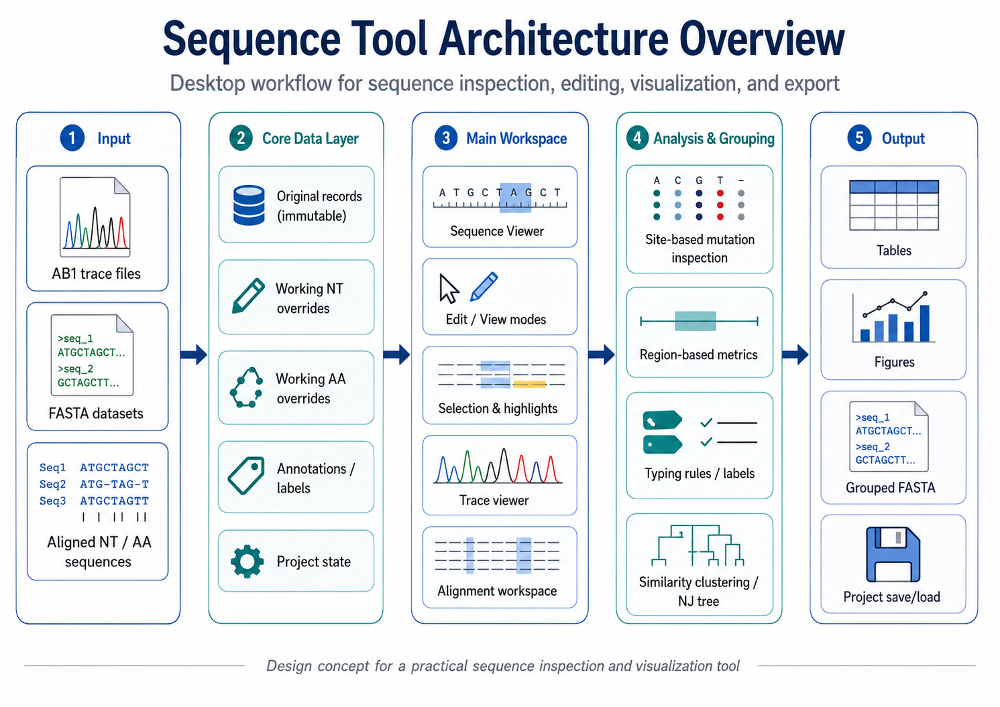

# Devlog 01 — Why I started building a sequence viewer

*Figure 1. Overall architecture concept for the sequence inspection and visualization tool.*

## Background

I started this project because existing sequence viewers did not fully match the workflow I wanted for editable aligned sequence data.

The initial goal is to combine sequence editing, mutation inspection, and visualization in a single desktop tool.
