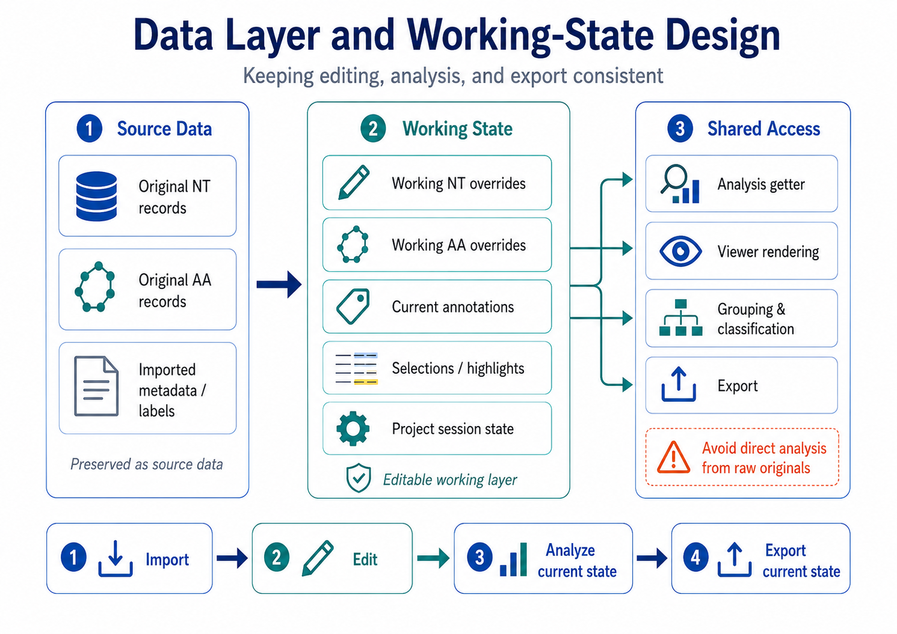
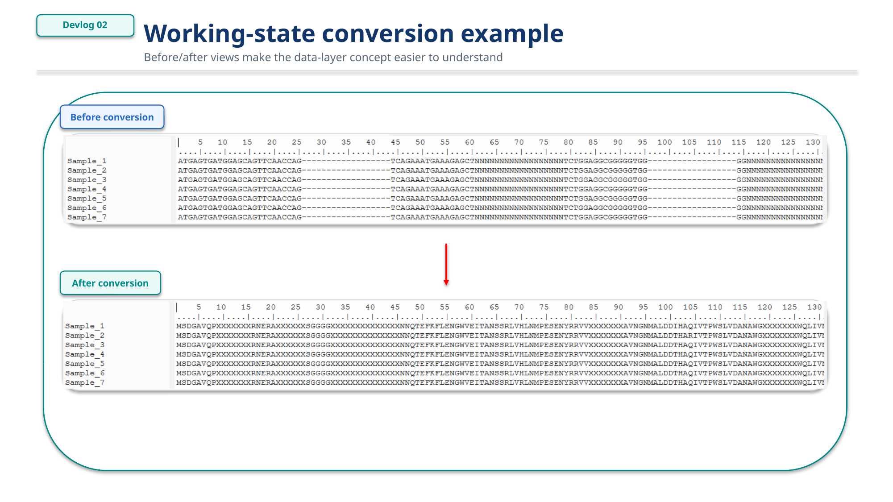
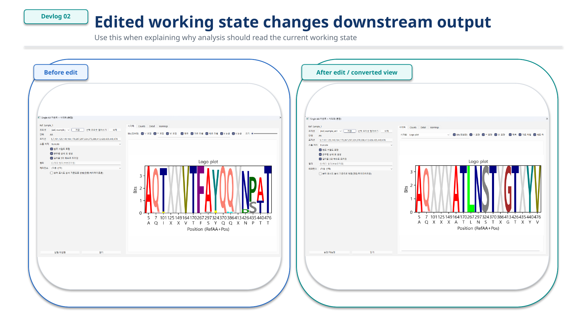

# Devlog 02 — Data Layer and Working-State Design

## Background

One of the main design challenges in this project is keeping sequence editing, visualization, classification, and export consistent.

If a user edits a sequence in the viewer, every downstream feature should use the edited working sequence rather than accidentally reading the original input again.

This becomes especially important when DNA/RNA and protein sequences are handled together.

## Core design idea

*Figure 1. Data layer and working-state design.*

The current design separates original sequence data from editable working data.

The original input records are preserved as the source data, while edited sequences are stored as working overrides.

This makes it possible to keep the original data safe while still allowing the user to edit, transform, analyze, and export the current working state.

## Working-state strategy

The basic strategy is:

- keep original records immutable
- store edited nucleotide sequences separately
- store edited amino acid sequences separately
- use a single analysis getter for visualization, classification, grouping, and export
- avoid letting analysis functions directly access raw original records

*Figure 2. Working-state conversion example.*

*Figure 3. Edited working state changes downstream output.*

## Why this matters

This structure helps prevent a common problem in sequence tools: the viewer shows one state, but the analysis runs on a different state.

For this project, the goal is to make the visible working sequence and the analysis input consistent.

## Current direction

The data layer is being designed around a practical workflow:

1. Import or open sequence data
2. Edit or transform sequences in the viewer
3. Run analysis using the current working state
4. Export tables, figures, or FASTA files from the same working state

This design is still evolving, but it forms the foundation for future editing, visualization, and export features.
