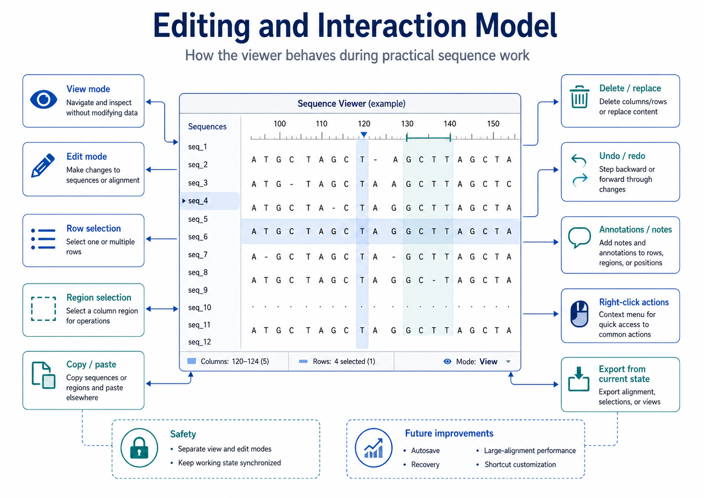
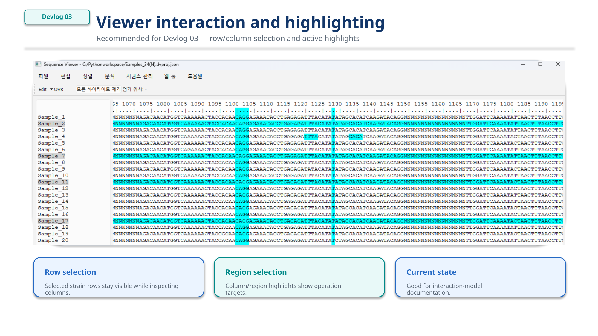
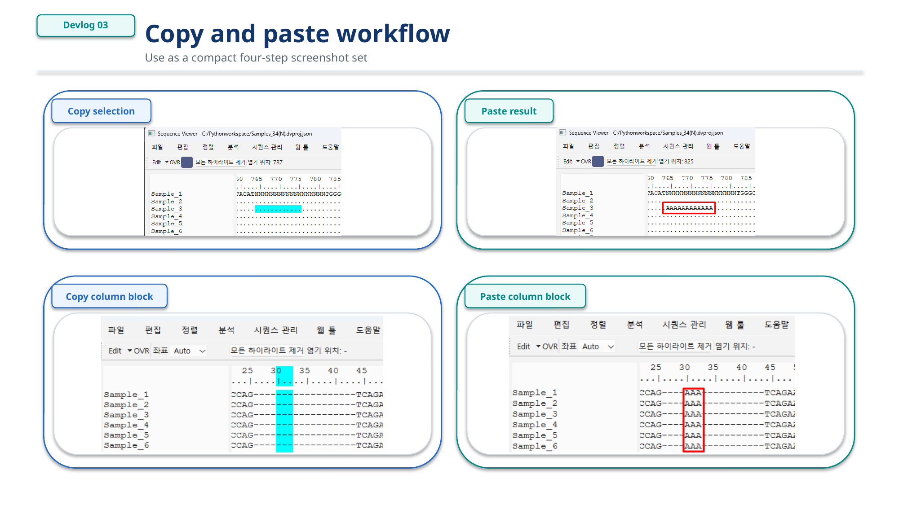

# Devlog 03 — Editing and Interaction Model

## Background

A sequence viewer becomes much more useful when users can interact with the sequence data directly.

For this project, editing is not treated as a small extra feature. It is part of the core workflow.

The goal is to let users inspect, select, copy, paste, trim, delete, and prepare sequence regions without constantly moving between different tools.

## Interaction goals

*Figure 1. Editing and interaction model for the sequence viewer.*

The current interaction model focuses on:

- selecting sequence rows
- selecting sequence regions
- copying selected sequence data
- deleting or replacing selected regions
- separating view mode and edit mode
- supporting undo and redo behavior
- keeping analysis results synchronized with edited sequences

*Figure 2. Viewer interaction and highlighting.*

*Figure 3. Copy and paste workflow.*

## Why view mode and edit mode are separated

Sequence data can be fragile.

Accidental edits may affect downstream analysis, classification, and export.

For this reason, the viewer separates normal viewing from active editing. This makes the program safer to use while still allowing direct editing when needed.

## Editing as a data-layer operation

Editing should not only change the text shown on screen.

Every edit should update the working sequence state so that visualization, grouping, classification, and export all use the same edited data.

This is why the editing model is connected to the data layer rather than being implemented as temporary text changes only.

## Future interaction ideas

Planned or possible interaction improvements include:

- right-click context menus
- annotation or note layers
- persistent region labels
- better highlight handling
- shortcut customization
- autosave and recovery
- large-alignment performance improvements

The long-term goal is to make the viewer feel closer to a practical sequence workbench than a passive FASTA text viewer.
