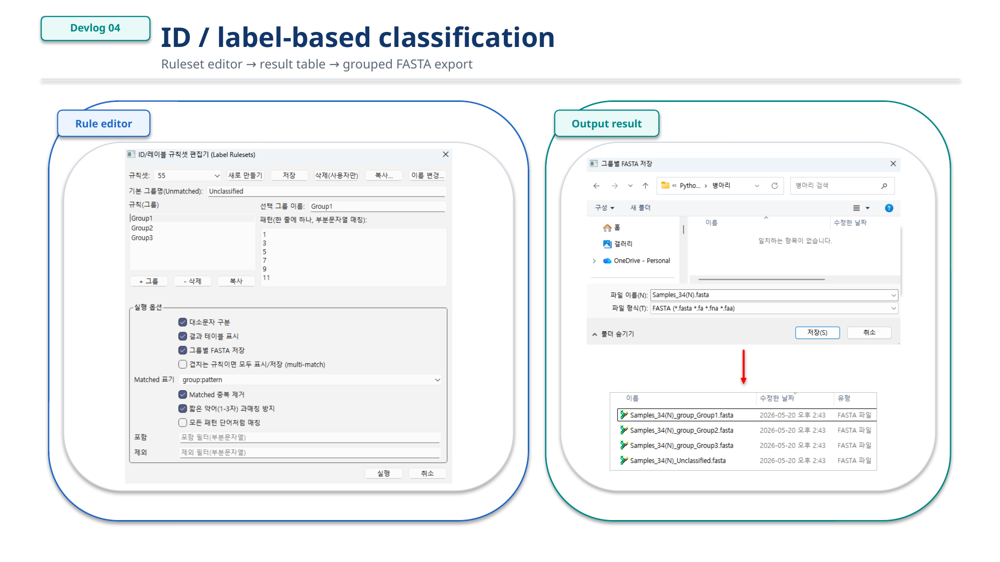
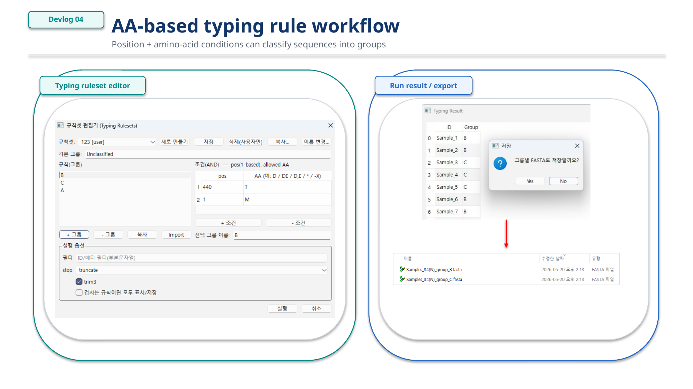
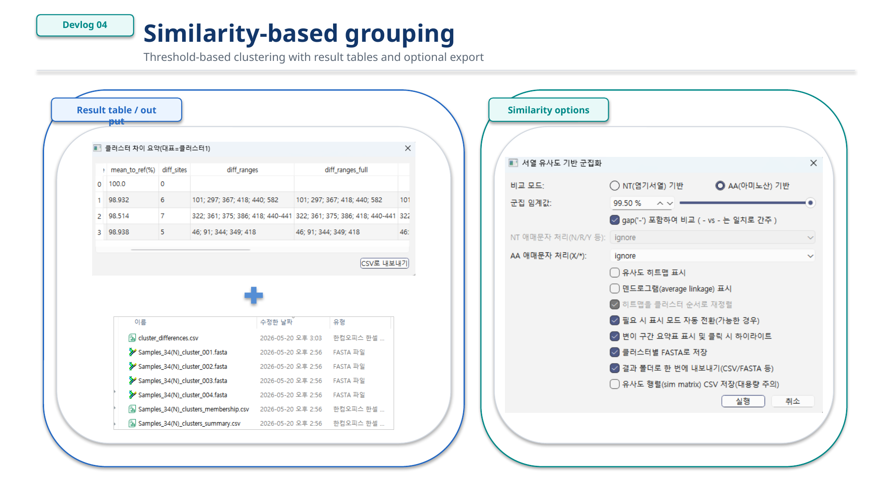
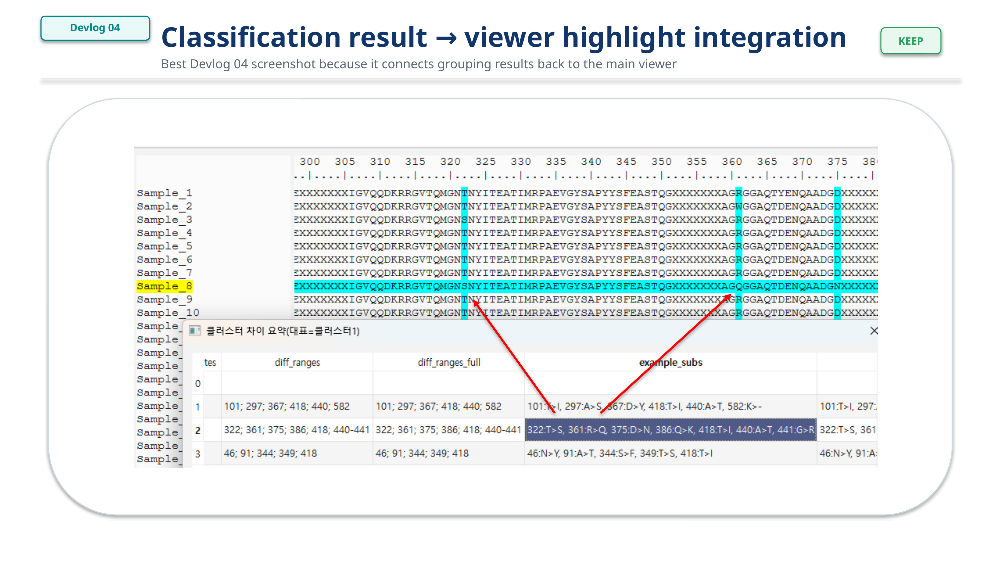

# Devlog 04 — Classification and Grouping Workflow

This devlog summarizes the current classification and grouping workflow of the sequence viewer.

The main goal is not to replace full phylogenetic or statistical analysis tools. Instead, this workflow is designed to help users quickly organize sequence datasets into practical groups before deeper inspection, visualization, or export.

At this stage, the grouping workflow is built around three main approaches:

- ID / label-based grouping
- AA-based typing-rule grouping
- Similarity-based grouping

The important design point is that these workflows are connected back to the same working sequence state used by the viewer, visualization dialogs, tables, and export tools.

> Demo screenshots use masked or synthetic public-reference-derived sequence data with renamed display IDs.

---

## Overview

Sequence datasets often need to be organized before they can be interpreted efficiently.

For example, users may want to separate sequences by sample labels, known amino-acid markers, or overall sequence similarity. Each method answers a slightly different question.

| Workflow | Main question | Best used for |
|---|---|---|
| ID / label-based grouping | Can I group records by names or metadata-like labels? | country, year, sample type, project labels |
| AA-based typing rules | Can I classify sequences by known amino-acid markers? | marker-based typing, known substitutions, simple rule-based classification |
| Similarity-based grouping | Which sequences are close to each other overall? | exploratory grouping, redundancy checks, quick cluster inspection |

The current design treats grouping as a practical inspection step. The output can be reviewed in tables, linked back to the viewer, or exported as grouped FASTA files.

---

## ID / label-based grouping

The simplest grouping method is based on sequence IDs or description text.

This is useful when sequence names already contain meaningful patterns such as sample origin, year, batch, host, genotype labels, or manually assigned tags.

The workflow is straightforward:

1. Define group names.
2. Add one or more matching patterns for each group.
3. Run the grouping step.
4. Review the result table.
5. Export grouped records if needed.

This method is intentionally simple. It is not meant to infer biological meaning by itself. Instead, it helps users organize already-labeled datasets quickly.

Example use cases:

- Grouping records by sample prefix
- Separating known batches
- Collecting sequences with shared naming patterns
- Preparing group-specific FASTA exports

Because this method depends on text patterns, it works best when sequence IDs are consistently named.

*Figure 1. ID and label-based classification workflow.*

---

## AA-based typing-rule grouping

AA-based typing-rule grouping is used when classification depends on specific amino-acid positions.

Instead of grouping by the sequence name, this workflow checks whether a translated or amino-acid sequence satisfies predefined marker conditions.

A rule can be understood as a simple position-based condition:

- If position 426 is D, assign Group A.
- If position 426 is E, assign Group B.
- If multiple position conditions match, assign the corresponding group.

This is useful for marker-based classification where a small number of known positions are more informative than the full alignment.

The rule-based approach is especially useful when:

- Known amino-acid substitutions define meaningful types
- Users want reproducible classification rules
- The same marker set needs to be reused across datasets
- Classification should be explainable through positions and residues

This workflow is intentionally lightweight. It is designed for practical marker-based grouping, not for complex model-based classification.

*Figure 2. AA-based typing-rule grouping workflow.*

---

## Similarity-based grouping

Similarity-based grouping is used when predefined labels or marker rules are not enough.

This workflow compares sequences and groups them using a similarity threshold. It can be useful for quickly detecting highly similar sequence sets, possible duplicates, rough clusters, or groups that should be inspected together.

The current workflow focuses on practical inspection:

- Choose NT or AA comparison mode
- Set a similarity threshold
- Choose how to handle gaps or ambiguous characters
- Optionally review heatmap or dendrogram-style output
- Inspect result tables
- Export grouped sequences

This is not intended to replace full phylogenetic analysis. The purpose is to provide a fast grouping and inspection layer inside the viewer.

*Figure 3. Similarity-based grouping workflow.*

---

## Linking grouping results back to the viewer

A useful grouping workflow should not stop at a table.

One of the main goals of this tool is to connect classification results back to the sequence viewer. After grouping or classification, users should be able to inspect the relevant sequences directly in the alignment view.

This makes the workflow more practical:

1. Run grouping.
2. Review the result table.
3. Select or inspect a group.
4. Highlight related records in the viewer.
5. Continue with site-based or region-based visualization.

This connection is important because grouping is often only the first step. After a group is found, users usually want to inspect where the differences are, whether known markers are present, or whether a specific region explains the grouping.

*Figure 4. Classification result linked back to viewer highlights.*

---

## Why multiple grouping methods are needed

No single grouping method is enough for all sequence datasets.

ID-based grouping is fast and convenient, but it depends on naming quality.

AA-based typing rules are explainable and useful for known markers, but they require prior knowledge.

Similarity-based grouping is useful for exploration, but it may not directly explain which biological feature matters.

The current design keeps these workflows separate but connected.

- ID / label grouping is useful for metadata-like organization.
- AA typing rules are useful for known marker-based classification.
- Similarity grouping is useful for exploratory clustering.

The long-term goal is to let users move between these methods without losing context.

For example, a user may first group records by ID, inspect marker positions, compare similarity, highlight selected groups in the viewer, and then export tables or FASTA files.

---

## Current limitations

This workflow is still under active development.

Current limitations include:

- Tree-based grouping is not yet the main workflow.
- Label and typing-rule editors still need more polishing.
- Similarity grouping needs more option-combination testing.
- Large datasets may require more careful performance handling.
- Grouping results should eventually connect more smoothly with annotation and reporting workflows.

These limitations are acceptable for the current stage because the main purpose is to validate the workflow structure first.

---

## Next steps

The next improvements will focus on making classification results easier to inspect and reuse.

Planned directions include:

- Cleaner label/ruleset editing
- Better grouped result review
- Stronger links between grouping result tables and viewer highlights
- Optional tree-assisted grouping
- Grouped export improvements
- Integration with annotation and reporting workflows

The final goal is a practical workflow where users can move from raw sequence records to grouped inspection results, figures, and exportable tables with minimal manual rearrangement.
