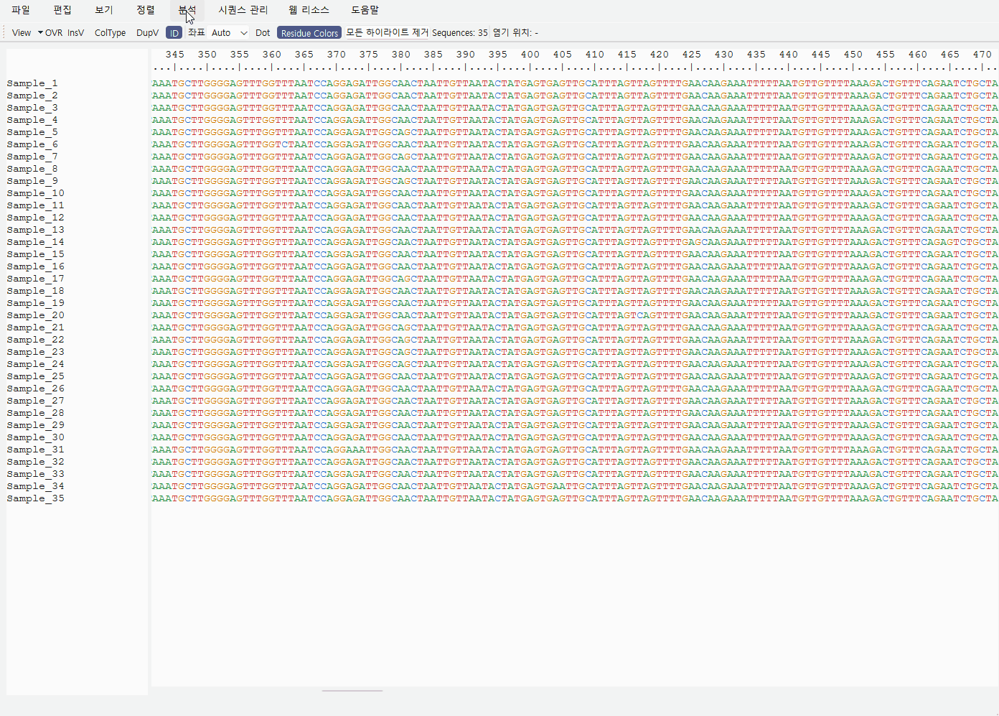

# Devlog 05 — Visualization and Inspection

This devlog summarizes the visualization and inspection workflow of JU SeqWorkbench.

The goal of this part is not only to draw figures, but to make routine sequence checking faster: selecting positions or regions, comparing observed residues, checking variation patterns, and exporting tables or figures for later review.

The visualization features are designed around two related but different questions:

- What happens at specific marker sites?
- What patterns appear across continuous sequence regions?

For this reason, the project separates point/site-based visualization and region-based visualization instead of treating them as the same workflow.

> Existing demo images on this page are kept as development snapshots. The visualization layer is still being revised for the first alpha and later updates.

---

## Overview

Sequence inspection often starts from specific positions.

For example, users may want to check known marker sites, amino-acid substitutions, nucleotide positions, or codon positions that are already considered important.

However, not all sequence differences can be understood from isolated positions. Some datasets require region-level inspection, where the goal is to see whether variation is concentrated across a continuous interval or distributed across multiple regions.

The current visualization workflow therefore has two layers:

| Visualization type | Main input | Main purpose |
| --- | --- | --- |
| Point Visualization | Individual AA, NT, or codon positions | Inspect known markers, hotspots, or selected positions |
| Region Visualization | Continuous intervals or multiple regions | Inspect variation patterns across sequence regions |

<figure>
  
  <figcaption><em>Figure 1. Visualization and inspection workflow.</em></figcaption>
</figure>

The goal is not to replace full statistical or phylogenetic tools. Instead, the visualization workflow is intended to help users quickly inspect sequence differences, organize what they see, and decide what needs deeper analysis.

---

## Point Visualization

Point Visualization is focused on selected positions.

This is useful when users already know which positions are important or want to compare a small set of marker sites across many sequences.


Typical use cases include:

- checking known amino-acid marker positions
- comparing nucleotide, codon, or amino-acid changes
- inspecting selected positions across multiple sequences
- checking non-reference patterns against a selected reference
- generating quick tables and figures for inspection

The current alpha source supports multiple point-oriented outputs, including logo-style plots, heatmaps, mutation-map views, entropy/frequency-oriented summaries, and count/detail tables depending on analysis mode.

<figure>
  
  <figcaption><em>Figure 2. Site based visualization outputs.</em></figcaption>
</figure>

<figure>
  
  <figcaption><em>Figure 3. Site based visualization table.</em></figcaption>
</figure>

This workflow is most useful when the question is precise:

- Which residue appears at this position?
- How many sequences differ from the reference?
- Is this marker conserved or variable?
- Which sequences carry a particular pattern?

---

## Region Visualization

Region Visualization focuses on continuous intervals or multiple regions.

This workflow is useful when users want to inspect whether variation is concentrated across a wider region, or when a gene, domain, ORF interval, segment interval, or other defined span should be reviewed as a unit.



Example region inputs include:

- 10-50
- 120-180
- HA1:50-150
- RegionA:300-360

Typical use cases include:

- finding regions with high variation
- checking entropy across a continuous interval
- inspecting gap or unknown-token rates
- checking non-reference burden
- reviewing mutation-map-like patterns across sequences
- inspecting strain-wise variation profiles across a selected range

<figure>
  
  <figcaption><em>Figure 4. Region based visualization outputs.</em></figcaption>
</figure>

<figure>
  
  <figcaption><em>Figure 5. Region-based table.</em></figcaption>
</figure>

Region-based visualization is especially useful when a few marker sites are not enough to understand the overall pattern.

---

## Why point and region workflows are separated

Point-based and region-based visualization may look similar from the outside, but internally they answer different questions.

Point inspection asks:

> What is observed at these selected positions?

Region inspection asks:

> How does variation behave across this continuous region?

Because of this, the workflows use different input formats, coordinate meanings, metric calculations, presets, and table structures. Keeping them separate reduces the risk of mixing marker-based interpretation with region-level interpretation.

---

## Region layout and inspection modes

The region workflow supports multiple ways to organize the same selected intervals.

### Panel mode

Panel mode shows regions separately so that each interval keeps its own coordinate meaning.

### Concatenate mode

Concatenate mode displays multiple selected regions in a connected pseudo-coordinate view. Real genomic distance is not preserved, so separators and labels remain important.

### Summary / profile-oriented inspection

The region layer also supports higher-level summary or strain-oriented views when the user wants to compare region-level variation or sequence-wise burden rather than inspect every position in the same way.

---

## Connection with the working-state workflow

One important design principle is that visualization should not read only the original imported sequence data.

The viewer allows editing, conversion, grouping, alignment replacement, and other interactions. Visualization therefore needs to use the current working state whenever possible.

This matters for workflows such as:

- editing or trimming sequences before visualization
- translating NT data into AA views
- grouping sequences and then inspecting selected regions
- exporting figures and tables based on the current review state

---

## August 2026 implementation update

The first alpha now has a broader visualization layer than the early screenshots on this page show.

Current alpha preparation includes:

- Point Visualization separated into AA, NT, and codon workflows
- multiple point-oriented plot types and detail tables
- Region Visualization with multiple metrics and layout styles
- searchable/exportable result tables
- large-analysis preflight warnings and busy/progress feedback where needed
- shared working-sequence access so analysis reflects the current edited data path

The existing images are being left in place because they still document the development path. The next major work is expected to change the presentation more than the basic alpha screenshots do.

---

## Post-alpha visualization priority

Visualization modernization is one of the highest-priority updates planned after the first alpha release.

Recent feedback highlighted that users now compare scientific desktop output not only with older bioinformatics software, but also with the polished figures that current AI-assisted analysis and plotting tools can produce quickly. That does not mean JU SeqWorkbench should simply imitate AI-generated charts. The more useful goal is to make the visualization layer clearer, more modern, and more tightly connected to the underlying sequence data.

Areas to explore include:

- cleaner visual hierarchy and more readable default layouts
- improved mutation maps and region summaries
- group-aware and relationship-aware comparison views
- easier movement from a summarized visual pattern back to the sequences that produced it
- publication/report-oriented figure options where appropriate
- visual designs collected directly from alpha-user requests, papers, and tools that users already rely on

Alpha feedback will explicitly ask users what they want to visualize, what data should be compared, and which existing figure/table formats they find useful.

---

## Relationship-aware analysis before visualization

The current point workflow assumes that the selected positions are already meaningfully comparable across the aligned sequences.

That assumption becomes weaker with highly divergent viral datasets. Even sequences described with the same ORF or segment label may require relationship, similarity, tree, or homologous-region inspection before site-by-site comparison is biologically useful.

For that reason, a major post-alpha direction is to place a sequence-relationship layer before point/region visualization when needed:

```text
Sequence set
→ relationship / similarity inspection
→ select a comparable clade, ORF, segment, or candidate homologous region
→ MSA / alignment review
→ point or region visualization
```

ORF and segment will be treated as distinct biological levels rather than interchangeable range labels.

---

## Rendering and performance

More informative visualization also increases rendering cost.

Post-alpha work will therefore include rendering and responsiveness improvements alongside visual redesign. Planned investigation includes reducing unnecessary full redraws, improving large-table responsiveness, and considering visible-range or incremental rendering strategies for larger alignments and richer result views.

This is important because a more attractive plot is not useful if the interaction around it becomes slow.

---

## Current limitations

The visualization layer remains alpha-stage work.

Current limitations include:

- plot presentation still needs visual polishing
- relationship/homology-aware upstream analysis is not implemented yet
- group-to-group comparison is still planned work
- larger datasets may still require additional rendering and performance optimization
- more real-user testing is needed for table and figure usability

The first alpha is intended to validate the current sequence-review workflow first, then use feedback to decide which visualization and comparison formats deserve deeper development.
