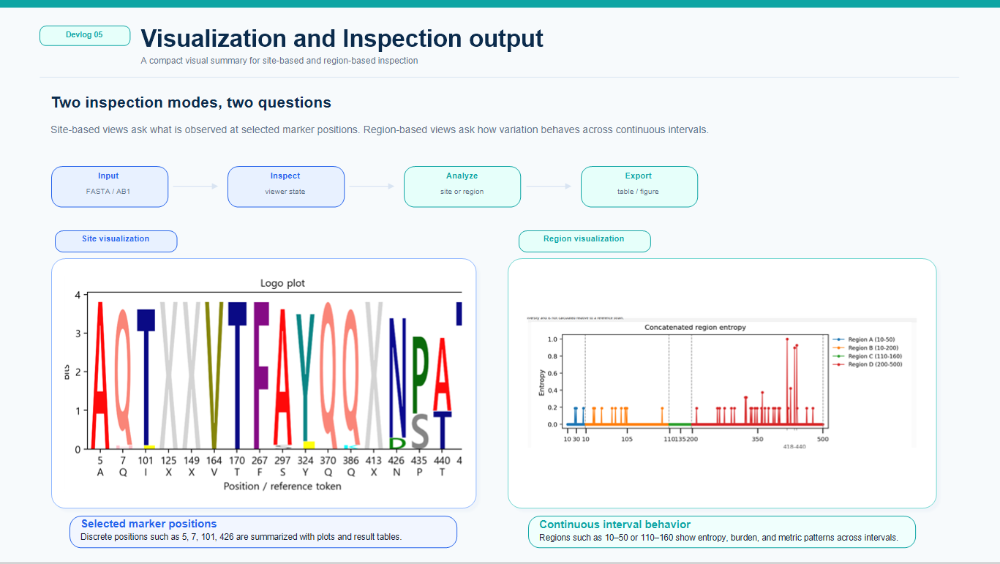
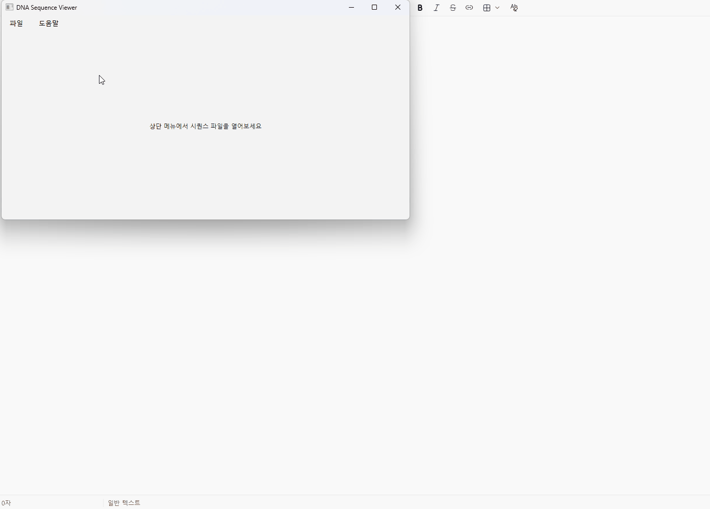
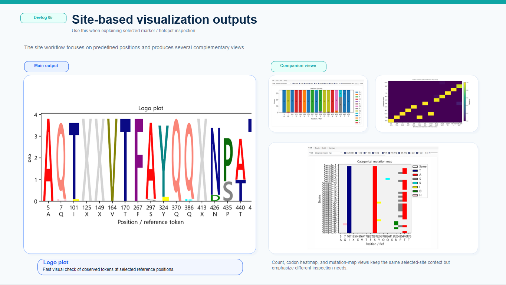
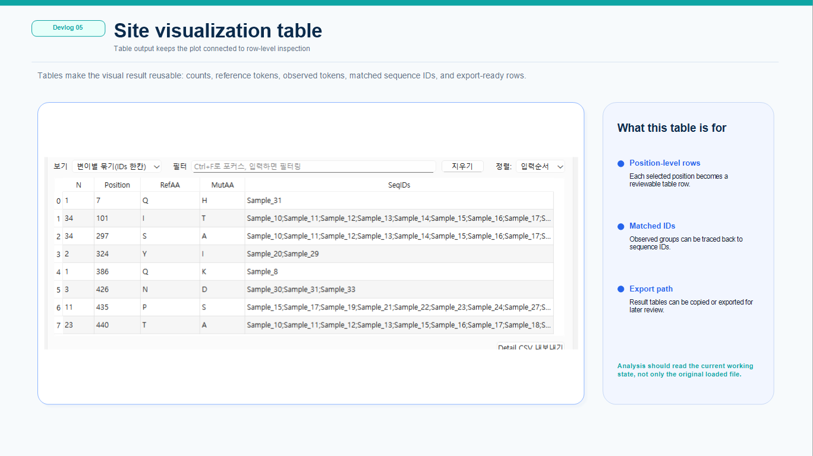
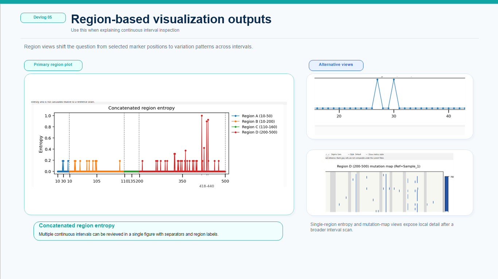
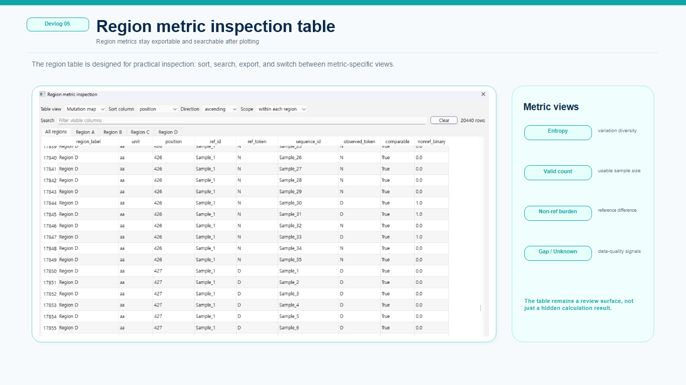

# Devlog 05 — Visualization and Inspection

This devlog summarizes the visualization and inspection workflow of the sequence viewer.

The goal of this part is not only to draw figures, but to make routine sequence checking faster: selecting positions or regions, comparing observed residues, checking variation patterns, and exporting tables or figures for later review.

The visualization features are being designed around two related but different questions:

* What happens at specific marker sites?
* What patterns appear across continuous sequence regions?

For this reason, the project separates site-based visualization and region-based visualization instead of treating them as the same workflow.

> Demo screenshots will be added later. Current development notes are based on masked or synthetic public-reference-derived sequence data with renamed display IDs.

---

## Overview

Sequence inspection often starts from specific positions.

For example, users may want to check known marker sites, amino-acid substitutions, or nucleotide positions that are already considered important.

However, not all sequence differences can be understood from isolated positions. Some datasets require region-level inspection, where the goal is to see whether variation is concentrated across a continuous interval or distributed across multiple regions.

The current visualization workflow therefore has two layers:

| Visualization type         | Main input                                    | Main purpose                                       |
| -------------------------- | --------------------------------------------- | -------------------------------------------------- |
| Site-based visualization   | Individual positions such as 5, 7, 101, 426   | Inspect known markers or selected positions        |
| Region-based visualization | Continuous intervals such as 10-50 or 120-180 | Inspect variation patterns across sequence regions |

<figure>
  
  <figcaption><em>Figure 1. Visualization and inspection workflow.</em></figcaption>
</figure>

---

The goal is not to replace full statistical or phylogenetic tools. Instead, the visualization workflow is designed to help users quickly inspect sequence differences and decide what needs deeper analysis.

These features are still being polished, but the main direction is already clear: the viewer should help users move from raw sequence inspection to table/figure-based interpretation with fewer manual steps.

---

## Site-based visualization

Site-based visualization is focused on selected positions.

This is useful when users already know which positions are important or want to compare a small set of marker sites across many sequences.

Typical use cases:

* checking known amino-acid marker positions
* comparing nucleotide or amino acids changes
* inspecting selected positions across multiple sequences
* generating quick tables and figures for inspection

The site-based workflow is designed to support multiple visual outputs, including logo-style plots, heatmaps, mutation maps, entropy-style views, and count/detail tables.

<figure>
  
  <figcaption><em>Figure 2. Site based visualization outputs.</em></figcaption>
</figure>

<figure>
  
  <figcaption><em>Figure 3. Site based visualization table.</em></figcaption>
</figure>

---

This workflow is most useful when the question is precise:

* Which residue appears at this position?
* How many sequences have a non-reference token?
* Is this marker conserved or variable?
* Which sequences differ from the selected reference?

---

## Region-based visualization

Region-based visualization focuses on continuous intervals or multiple regions.

This workflow is useful when users want to inspect whether variation is concentrated across a wider region, or when a gene/domain/segment should be reviewed as a unit.

Example region inputs include:

* 10-50
* 120-180
* HA1:50-150
* RegionA:300-360

Typical use cases:

* finding regions with high variation
* checking entropy across a continuous interval
* comparing valid sample size across positions
* inspecting gap or unknown-token rates
* checking non-reference burden
* reviewing mutation-map-like patterns across sequences
  
<figure>
  
  <figcaption><em>Figure 4. Region based visualization outputs.</em></figcaption>
</figure>

<figure> 
 <figcaption><em>Figure 5. Region-based table.</em></figcaption>
</figure>

---

Region-based visualization is especially useful for larger or more complex viral sequence datasets, where a few marker sites may not be enough to understand the overall pattern.

---

## Why site and region workflows are separated

Site-based and region-based visualization may look similar from the outside, but internally they answer different questions.

Site-based inspection asks:

What is observed at these specific positions?

Region-based inspection asks:

How does variation behave across this continuous region?

Because of this, the two workflows use different input formats, x-axis meanings, metric calculations, presets, and table structures. Keeping them separate makes the interface easier to reason about and reduces the risk of mixing marker-based analysis with region-level interpretation.

This keeps the user workflow clearer and makes future extension easier.

---

## Region layout modes

The region workflow is being designed around multiple layout styles.

### Panel mode

Panel mode shows each region separately.

This is useful when each region should keep its own coordinate meaning. It is easier to interpret when comparing different genes, domains, or sequence intervals.

### Concatenate mode

Concatenate mode displays multiple regions as a connected pseudo-coordinate view.

This is useful when users want to compare several regions in one compact plot. Because real genomic distance is not preserved, separators and labels are important.

### Summary mode

Summary mode focuses on region-level overview rather than every individual position.

This is useful when the user wants to compare which region is more variable, more conserved, or more affected by gaps or unknown tokens.

---

## Connection with the working-state workflow

One important design principle is that visualization should not read only the original imported sequence data.

The viewer allows editing, trimming, conversion, grouping, and other interactions. Therefore, visualization should use the current working state whenever possible.

This means that site and region visualization should reflect the sequence state that the user is actually inspecting, not a stale copy of the original input.

This is especially important for workflows such as:

* editing or trimming sequences before visualization
* translating NT data into AA views
* grouping sequences and then inspecting selected regions
* exporting figures and tables based on the current review state

---

## Current status

At the current stage, the site-based visualization workflow is relatively mature compared with the region workflow.

The region-based visualization MVP has also been implemented and is now being reviewed through alpha polishing and smoke testing.

Current focus areas include:

* checking whether region inputs are parsed correctly
* confirming that table outputs are understandable
* testing region metrics with masked or synthetic demo data
* improving plot readability
* keeping site and region semantics clearly separated
* verifying export behavior

Screenshots and more detailed examples will be added after the visualization outputs are polished.

---

## Current limitations

This workflow is still under active development.

Current limitations include:

* Some region plots still need visual polishing.
* Large datasets may require additional performance handling.
* Table views need more usability testing.
* Some metric names and descriptions may need clearer wording.
* More screenshots and example datasets are needed for documentation.
* Region visualization should be tested across AA, NT, and codon units more thoroughly.

These limitations are acceptable at this stage because the main goal is to validate the workflow structure before presenting it as a stable feature.

---

## Next steps

The next improvements will focus on making visualization outputs easier to interpret and easier to document.

Planned directions include:

* adding clean screenshots for site and region examples
* improving region plot readability
* refining metric labels and table columns
* adding clearer example workflows
* connecting visualization results more smoothly with grouping and export
* preparing alpha-level smoke tests for common workflows

The long-term goal is to make the tool useful not only for viewing sequences, but also for quickly turning sequence differences into practical inspection results, tables, and figures.

