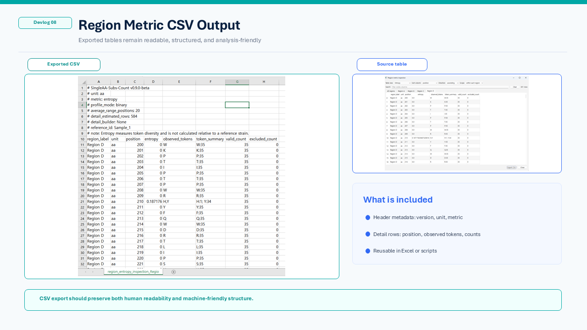

# Devlog 08 — Export and Reporting Workflow

This devlog focuses on the export side of the viewer workflow.

After sequence inspection or visualization, the result should not remain only as an on-screen figure.
For practical review, the output often needs to be copied, archived, checked again later, or reused in Excel, reports, or downstream scripts.

In the current alpha workflow, export is treated as a separate step from project saving.

* **Project save** keeps the current DNA Viewer working session.
* **Export** produces external files such as CSV tables, figures, or FASTA outputs for reuse outside the app.

This separation is important because a review session and a reusable result file serve different purposes.

## CSV export from inspection tables

The current export example focuses on region metric inspection tables.

The in-app table can be filtered, sorted, and reviewed interactively.
When exported as CSV, the table keeps both row-level result data and basic analysis metadata.

## What the CSV output preserves

The exported table is designed to keep the result understandable after leaving the application.

The current CSV output can include:

* analysis metadata such as version, unit, metric, and reference information
* region labels and coordinate information
* position-level rows
* observed tokens and token summaries
* valid and excluded counts
* values that can be opened directly in spreadsheet software

This makes the result easier to audit, share, and reuse.

## Why this matters

In small sequence-review workflows, visual inspection is often only one part of the work.

A user may need to:

* check a region visually
* inspect the underlying table
* export selected results
* attach the table to a report
* compare the output later with another dataset
* reuse the table in a downstream script

For that reason, the export format should remain both human-readable and machine-friendly.

## Current alpha scope

The current focus is CSV export from analysis and inspection tables.

FASTA-related export will be handled more carefully later, because sequence display modes such as dot mode should never affect the authoritative exported sequence data.
For alpha stabilization, export should always read from the current working sequence state rather than from rendered screen text.

## Notes

This devlog is not about building a full reporting system yet.
The goal is more basic and practical: make sure that analysis results can leave the viewer in a clean, reusable form.
