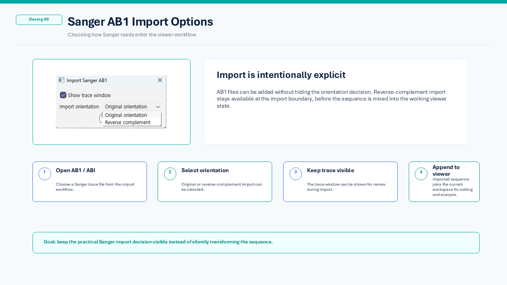
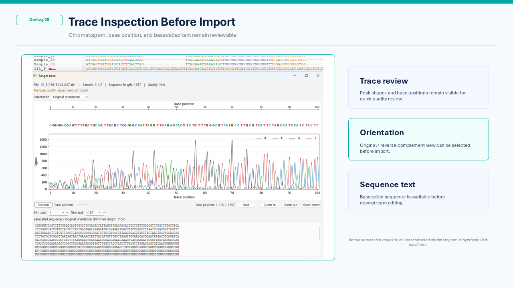

# Devlog 09 — Sanger AB1 Import and Trace Inspection

This devlog introduces the Sanger AB1 inspection workflow.

The goal is to keep Sanger trace review close to the sequence viewer, so that basecalled sequences can be checked and imported without jumping between unrelated tools.

## Why AB1 support matters

Sanger sequencing data is often reviewed in two layers:

* the **basecalled sequence**
* the underlying **chromatogram trace**

A FASTA sequence is convenient for alignment and downstream inspection, but it does not show the peak-level context behind the base call.

For practical sequence review, it is useful to open an AB1 file, inspect the trace, check the basecalled sequence, and then import the sequence into the viewer workflow.

## Current workflow

The current AB1 workflow supports:

* opening AB1 / ABI files
* showing a chromatogram trace window
* displaying the basecalled sequence
* showing available trace and quality-related information
* selecting original or reverse-complement orientation for import
* importing the sequence into the viewer

This keeps Sanger inspection connected to the later sequence-editing and alignment workflow.

## Orientation handling

Reverse reads are common in Sanger workflows.

For that reason, the AB1 import path includes an orientation option.
The user can import the sequence as stored, or as reverse-complement, depending on how the read should be compared with the reference or aligned dataset.

This is not intended to replace careful manual review.
It is meant to reduce repetitive orientation handling before downstream inspection.

## Trace review before import

The trace view keeps the chromatogram visible before the sequence is added to the main viewer.

This helps with quick checks such as:

* whether the trace is readable
* whether the basecalled sequence is present
* whether the read direction looks appropriate
* whether trimming or manual review may be needed later

## Current alpha scope

The current AB1 support is an early workflow feature.

It is focused on:

* viewing the trace
* checking the basecalled sequence
* choosing import orientation
* bringing the sequence into the viewer

More advanced Sanger functions such as automated trimming rules, quality-based filtering, and detailed peak editing can be considered later.

For now, the important point is that Sanger data can enter the same viewer workflow as FASTA and MSA-based sequence data.

