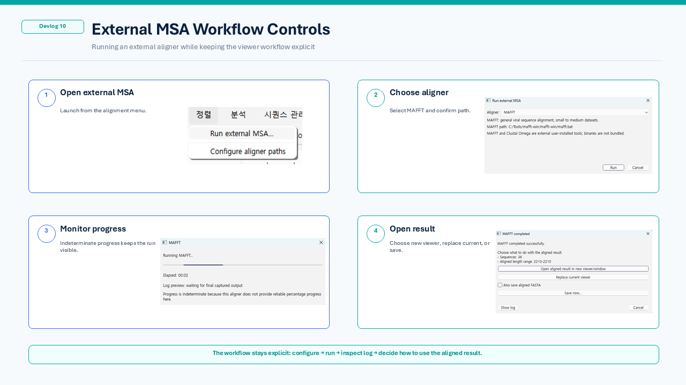
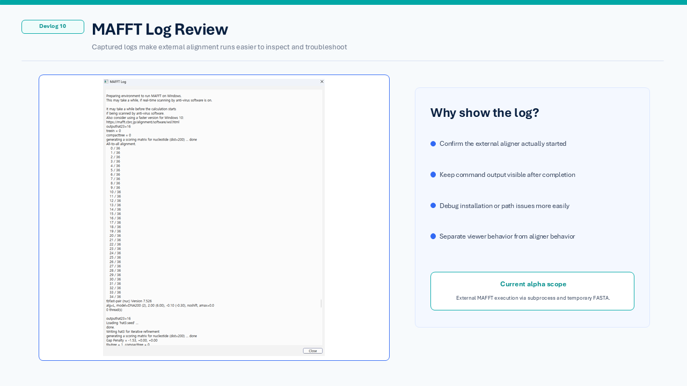
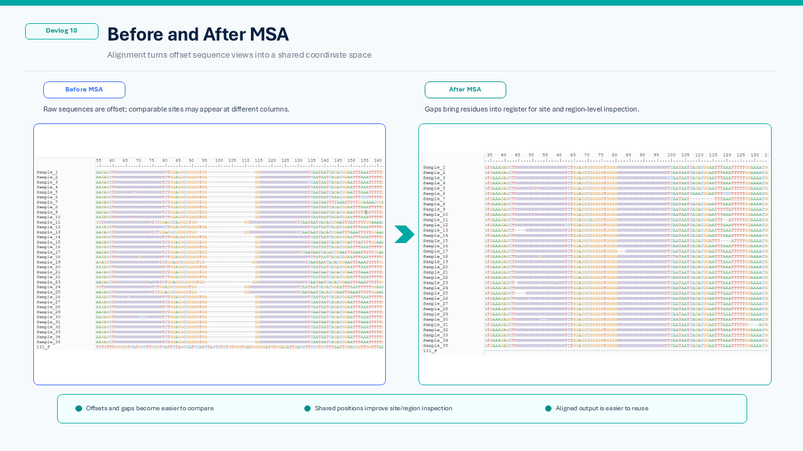
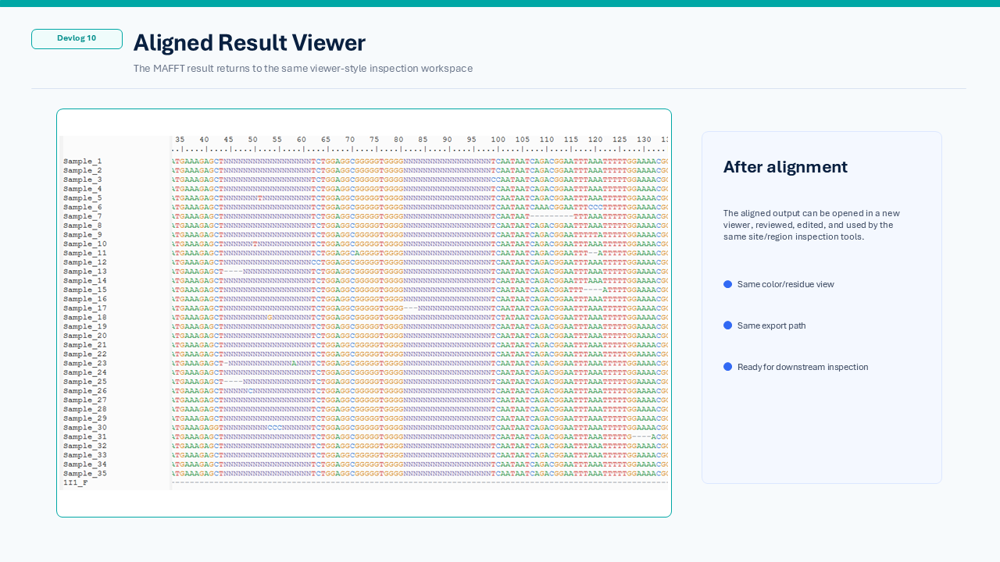

# Devlog 10 — External MSA Workflow

This devlog focuses on external multiple sequence alignment.

DNA Viewer is not intended to replace established MSA engines.
Instead, the viewer connects to external aligners and brings the aligned result back into the inspection workflow.

The current alpha path focuses on MAFFT.

## Why external MSA is used

Multiple sequence alignment is a core step before site-based or region-based inspection.

However, alignment itself is a specialized task.
Rather than reimplementing an aligner inside the viewer, the current workflow calls an external aligner through temporary FASTA files.

This keeps the viewer focused on:

* preparing current sequences for alignment
* running an external aligner
* showing progress and logs
* opening or replacing the aligned result
* continuing inspection after alignment

## Current workflow

The current external MSA workflow is:

1. Open the external MSA action from the alignment menu.
2. Choose the aligner.
3. Run MAFFT using the current viewer sequences.
4. Show progress while the aligner runs.
5. Keep a log for troubleshooting.
6. Open the aligned result in a new viewer or replace the current viewer.

This is designed as a practical desktop workflow rather than a hidden background process.

## MAFFT as the alpha path

MAFFT is currently treated as the recommended alpha aligner.

The app does not bundle MAFFT binaries in this alpha workflow.
Instead, the user configures the external MAFFT path, and the viewer calls it through subprocess and temporary FASTA input/output files.

This keeps the external tool boundary clear and makes troubleshooting easier.

## Before and after alignment

Before MSA, sequences may be offset or difficult to compare column-by-column.

After MSA, sequences are placed into a shared coordinate space.
This makes downstream inspection more useful, especially for site-based and region-based views.

## Why this matters for later inspection

Site and region analysis depend on meaningful coordinate alignment.

A cleaner aligned view helps with:

* comparing the same position across multiple sequences
* checking gaps and ambiguous regions
* running site-based mutation inspection
* running region-based metric inspection
* exporting a reusable aligned result

## Current alpha scope

The current goal is not to provide every possible alignment option.

The alpha focus is:

* use the current viewer sequences as input
* avoid accidentally passing project files as alignment input
* run MAFFT through a configured external path
* provide progress and log information
* let the user decide how to handle the aligned result

More advanced aligner options, additional tools, and deeper alignment parameter controls can be added later after the basic workflow is stable.

