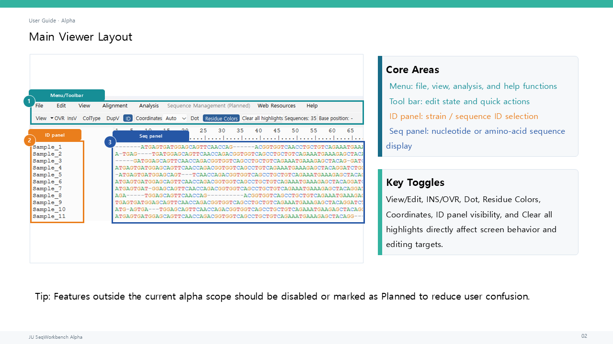

# JU SeqWorkbench Alpha User Guide — English Draft

**Other Language:** [한국어](user_guide_ko.md) | English

This document describes the currently implemented alpha behavior in reproducible steps for first-time testers. It uses the current English UI labels wherever practical.

## 1. JU SeqWorkbench Alpha overview

JU SeqWorkbench Alpha is a local desktop application focused on **Sanger/FASTA/MSA sequence review, editing, grouping, and site- or region-centered visualization**.

This application is not:

- an NGS mapper;
- a variant-calling pipeline;
- a genome assembler; or
- a clinical diagnostic system.

Recheck alpha results against representative data and keep backups of important originals.

## 2. Supported workflow and scope

1. Open FASTA/TXT or Sanger AB1/ABI files, or import them into the current viewer.
2. Review Sequence IDs and current working sequences, and edit only what is needed.
3. If necessary, align the sequences with a separately installed MAFFT or Clustal Omega executable.
4. Run Point Visualization, Region Visualization, ID/Name-based Grouping, AA Marker Classification, or Similarity-based Clustering.
5. Export Results Tables, figures, or FASTA files, or save the working state as a `.dvproj` project.

Depending on the operation, output may appear in a new viewer, a Results Table, a PNG/JPEG/SVG/PDF figure, a CSV or FASTA file, or a project file. Phylogenetic tree and Annotation layer are listed as planned features in Help and cannot be run from the current Analysis menu.

## 3. Main window layout

1. Use the top menu to access File, Edit, View, Alignment, Analysis, Web Resources, and Help.
2. Use the toolbar to control `View/Edit`, `OVR/INS`, `InsV`, `ColType`, `DupV`, `ID`, coordinate spacing, `Dot`, and Residue Colors.
3. Select rows in the Sequence ID panel on the left.
4. Review positions and characters in the Coordinate Ruler and Sequence Panel on the right.

`Sequence Management (Planned)` is visible but disabled. Hide or restore the ID panel through `View > Show ID Panel` or the toolbar `ID` control. Residue Colors can slow down large alignments.

Choose English or 한국어 under `Help > Language`. The choice is stored in local QSettings and, as the notice explains, requires an application restart before it applies throughout the UI.

## 4. Creating and opening projects

1. Open an empty workspace with `File > New` or `Ctrl+N`.
2. Open an existing project with `File > Open Project...`.
3. If the same project is already open, choose whether to activate the existing window, open an independent copy, or cancel.
4. An independent project copy cannot save directly to the original path; use `Save Project As...`.

The default project extension is `.dvproj`. The application can also open `.dvproj.json` and legacy `.json` files with a valid project signature. A normal sequence `Open` creates a separate viewer, while `Import` adds records to the current viewer.

## 5. Importing FASTA and sequence data

1. To view data in a new window, select `File > Open` or press `Ctrl+O`.
2. To add data to the current workspace, select `File > Import...` or press `Ctrl+I`.
3. Paste clipboard FASTA as new records with `Ctrl+Alt+V`.
4. If the application reports adjusted duplicate IDs, review the new suffixes.

FASTA, plain-sequence TXT, and AB1/ABI are included in the supported paths. A one-line FASTA-like entry must distinguish the ID and sequence, for example `>Sample_1 SEQUENCE`. If the raw sequence type is ambiguous, the application may ask whether it should be treated as NT or AA.

## 6. Reviewing and editing sequences

1. Switch the toolbar to `Edit` mode.
2. Click the Sequence Panel to place the cursor, or drag to select a range.
3. Press `Insert` to switch between `INS` (Insert mode) and `OVR` (Overwrite mode).
4. Use character input, `Delete`/`Backspace`, `Ctrl+X`, and `Ctrl+V`.
5. Review the result with `Ctrl+Z`/`Ctrl+Y`.

A normal drag replaces the previous Sequence Panel highlight. Holding `Ctrl` while dragging adds another highlight layer.

Characters that are invalid for the current row's NT, RNA, or AA type are blocked. When highlights exist, `Delete` removes actual sequence data from the most recent highlight, and `Ctrl+Delete` removes data from all active highlights. To remove only the visual highlighting, use `Clear All Highlights`.

To edit one sequence in a separate window, right-click its ID and select `Open Sequence in Editor...`. This modeless window can be switched freely with its parent viewer through Alt+Tab. `Apply` creates one undoable change in the parent.

## 7. Editing Sequence IDs

1. Select exactly one row in the ID panel.
2. Put either an ID copied with `Copy ID` or suitable plain text from an external application on the clipboard.
3. Keep focus in the ID panel and press `Ctrl+V`, or use the rename command in its context menu.
4. Check for `_2`, `_3`, or similar suffixes added to duplicate names.

The main ID-panel context-menu commands behave as follows.

- `Copy ID`: copies the selected ID name. With multiple selected rows, it copies the selected IDs.
- `Copy Sequence`: copies only the current working sequence of exactly one strain, without a header. This clipboard payload is not valid for renaming an ID.
- `Copy as FASTA`: copies IDs and sequences as FASTA. Multiple selected rows remain separate FASTA records.
- `Open Sequence in Editor...`: opens the selected single strain in a separate modeless editor.
- `Paste ID / Rename ID from Clipboard`: renames one ID from `Copy ID` data or suitable plain text. Data produced by `Copy Sequence` is not applied as an ID.
- `Delete Strain...` / `Delete Selected Strains...`: deletes the selected strains. The operation supports `Ctrl+Z`/`Ctrl+Y` undo and redo.
- `Move Sequence...`: with exactly one strain selected, start the command and click a destination ID to move the source immediately above it. Press `Esc` to cancel a pending move. The move supports `Ctrl+Z`/`Ctrl+Y`.
- `Move to Bottom`: moves the selected single strain to the end of the list and supports `Ctrl+Z`/`Ctrl+Y`.

Clipboard rename does not run when multiple IDs or no ID are selected. With multiple selection, ID/FASTA copying and selected-strain deletion are available, but `Copy Sequence` does not run and directs the user to `Copy as FASTA`. Editor opening, ID rename, and movement follow the single-row policy. `Ctrl+Alt+V` in the ID panel retains its existing Paste as New Sequence meaning rather than renaming an ID.

## 8. External alignment setup

1. Install MAFFT or Clustal Omega separately from the application.
2. Open `Alignment > Configure external aligners`.
3. Select a local executable, or leave its path empty.
4. Save the settings and close the configuration window.

The executables are not included with or automatically downloaded by JU SeqWorkbench. A path selected by the local user is stored in the existing QSettings. If the path is empty, the application checks `PATH` for `mafft` or `clustalo` when an alignment is run. The test controls in the settings window check the selected local executable with a temporary FASTA.

## 9. Running MAFFT or supported aligners

1. Confirm that the current workspace contains at least two sequences to align.
2. Select `Alignment > Run external MSA...`.
3. Choose MAFFT or Clustal Omega.
4. Review the progress window and any error or log output.
5. On success, choose whether to open a new viewer, replace the current viewer, save the aligned FASTA, or discard the result.

The application creates a temporary FASTA, runs the external process, and reads the aligned FASTA. Replacing the current viewer is recorded in edit history and clears highlights. After failure, a temporary directory may be retained for diagnostics; its path and command are available in the log.

## 10. NT, AA, DNA, and RNA transformations

1. Select the ID rows to transform. With no selection, all rows are targeted.
2. Use `Ctrl+D`/`AA View`, `Ctrl+W`/`DNA View`, or `Ctrl+E`/`RNA View`.
3. Check the transformed, restored, and skipped counts in the status bar.
4. Use `Ctrl+Z` if the operation needs to be undone.

AA view translates NT source data in frame 0. DNA view returns to the retained NT working state and does not arbitrarily reverse-translate AA-only records. RNA view switches the `T/U` display. Transformations clear Sequence Panel and column highlights; RNA transformation also clears ID selection.

The shortcuts for reverse, complement, and reverse complement are `Ctrl+Alt+R`, `Ctrl+Alt+C`, and `Ctrl+Alt+X`. With no selected range or ID row, they apply to all sequences.

## 11. Point Visualization

1. Under `Analysis > Visualization`, choose AA, NT, or Codon Point Visualization.
2. Enter 1-based positions, for example `10,25,50`.
3. Choose a reference sequence and filters, and set the required include/exclude options.
4. Click `Run`.
5. Review the Visualization, Counts, Detail, and Warnings tabs.

Point Visualization provides logo plots, heatmaps, binary and categorical mutation maps, entropy, major allele frequency, excluded counts, variant bars, and composition stacked bars for selected positions.

Selecting a row in Counts or Detail highlights the corresponding parent-viewer positions and sequence rows when the sequence units are compatible. Results can be exported with the CSV and figure save controls.

Presets are stored in the user's settings location. The current distribution has no dataset-specific marker positions as defaults.

## 12. Codon logoplot

1. Choose `Logo plot` in AA or NT Point Visualization, or `Codon logo plot` in Codon Point Visualization.
2. Adjust the gap, stop, unknown, and bits/frequency options.
3. Choose the font, size, axis visibility, and publication style.
4. Render again and save the figure.

A codon logo plot displays each codon as a three-character token. Observed complete tokens such as `GAT`, `-AT`, `A-T`, `AT-`, `NAA`, and `TAA` remain distinct. **Gap-containing Codon**, **Codon Containing Ambiguous Bases**, and **Stop Codon** classifications control only color and legend content; category names are not rendered as logo glyphs. Canonical codon colors are assigned by codon identity.

## 13. Region Visualization

1. Open `Analysis > Visualization > Region Visualization`.
2. Enter one or more start-end ranges.
3. Choose the reference sequence and profile or summary options.
4. Run the analysis and review the figure and region metrics table.
5. Save output with `Export CSV` or `Save figure`.

Region Visualization covers variation by range, entropy, profiles, and burden summaries. Figure output supports PNG/JPEG and SVG/PDF paths. The window is currently English-first, and clicking a result cell or figure point does not highlight the parent viewer.

## 14. ID/Name-based Grouping

1. Open `Analysis > Clustering / Classification > ID/name Grouping`.
2. Create a ruleset with `New`, then add group rules.
3. Enter a neutral group name such as `Group_A` and one ID pattern per line.
4. Review case sensitivity, boundary matching, multiple-match, and display-format options, then save.
5. Choose whether to show the Results Table and save grouped FASTA, then run the grouping.

The application compares each current Sequence ID/name string with the rule patterns to form groups. On success, the configuration window closes and the Results Table is brought forward after the completion message. On validation or runtime failure, the window remains open. Normal row selection in this Results Table is not linked to parent-viewer highlighting.

## 15. AA Marker Classification

1. Open `Analysis > Clustering / Classification > AA Marker Classification`.
2. Because there is no built-in default ruleset, create a user ruleset with `New`.
3. Add groups and conditions, then enter a 1-based Position and Allowed AA values.
4. Save the ruleset and choose stop handling, multiple-match, Results Table, and grouped-FASTA options.
5. Click `Run` and review the output.

Position accepts digits only and then undergoes the existing range validation. Allowed AA is normalized to uppercase and accepts only supported characters. Incomplete or invalid editor buffers are not stored in the model. When moving to another rule, the application warns that unapplied values were discarded and displays the clicked rule. A completely blank new condition can be discarded without a warning.

On success, the configuration window closes and the Results Table is brought forward after the message. On failure, the window remains open. User rules continue to use the existing `typing_rulesets.json` storage format.

## 16. Similarity-based Clustering

1. Open `Analysis > Clustering / Classification > Similarity Clustering`.
2. Choose NT or AA comparison mode and a clustering threshold.
3. Set gap and ambiguity handling, full-sequence or manual range, and heatmap, dendrogram, and variation-range-table options.
4. Run it for the selected ID rows, or for all current sequences when no rows are selected.
5. Review the Results Table and any optional figure, FASTA, or result bundle.

At least two sequences are required. If lengths differ, the application asks you to check the alignment. A manual range uses 1-based coordinates in the current comparison mode. On success, the configuration window closes and the Results Table comes forward; on failure, it remains open. A Results Table row highlights cluster members, while a variation-range row highlights members and, where possible, the column range in the parent viewer.

## 17. Results Tables and viewer highlighting

1. Select a row in Point Visualization Counts/Detail or a Similarity Results Table.
2. Check the highlighted ID rows and positions in the parent viewer.
3. If a display-mode mismatch message appears, compare the analysis mode with the current NT/AA display.
4. Use `Clear All Highlights` when the linked result should be cleared.

Not every Results Table is linked to its parent viewer. The confirmed links are Point Visualization and Similarity Results Tables. Normal row selection in Region Visualization, AA Marker Classification, and ID/Name-based Grouping tables does not provide the same linkage. `Ctrl+C` in a table copies selected cells, including headers, as TSV text.

## 18. AB1 chromatogram workflow

1. Use `File > Open` to open AB1/ABI as a new document.
2. To add it to the current viewer, select AB1 under `File > Import...`.
3. Choose whether to show the trace window and whether to use original or reverse-complement orientation.
4. Review the trace, basecalled sequence, quality summary, and warnings.
5. Adjust the start/end trim range and import in the required orientation.

The application reads the basecalls already stored in the AB1 file and does not perform new basecalling. The trace window provides positional scrolling, previous/next navigation, zoom, and original/reverse-complement display. Duplicate IDs are adjusted when multiple AB1 files are imported.

## 19. Exporting tables and figures

1. Export main sequences as FASTA, a CSV sequence table, or TXT through `File > Export sequences...`.
2. Use a Results Table's CSV export button or its context-menu/copy commands.
3. Use the save controls in Point, Region, or Similarity figures.
4. When grouped FASTA output is enabled for grouping or classification, confirm the destination and overwrite choice.

Project save and data export are separate operations. `Ctrl+S` saves the project; it does not overwrite the source FASTA. AA-only records may be separated into AA FASTA and are not arbitrarily converted to NT. A Duplicate Viewer blocks project and viewer-level sequence-data exports.

## 20. Saving and reopening projects

1. Use `Ctrl+S` or `File > Save Project`.
2. Choose a path for the first save or for an independent project copy.
3. After ending the session, reopen it with `Open Project...`.
4. Check sequence order, current working state, and display settings.

Projects preserve original/current NT and AA working states and related viewer state. Undo/Redo history is not saved in the project, so a reopened session starts with new history. Keep a separate backup of project files during alpha testing.

## 21. Troubleshooting

1. If startup is slow, confirm that the startup screen appears first and wait for the first main-window event.
2. If an aligner executable error appears, check the configured path and `PATH`.
3. If Similarity or Point highlighting is not visible, align the NT/AA comparison mode with the current display type.
4. If FASTA paste is rejected in the Sequence Panel, use `Ctrl+Alt+V`.
5. To copy multiple records, use `Copy as FASTA`, not `Copy Sequence`.
6. The main `Ctrl+F` not performing a search is a known alpha limitation.
7. During large analyses, respond to the preflight notice, wait for the working indicator, and confirm that result generation has completed.

A configuration window that reports an error remains open so that its values can be corrected and run again. In an external MSA failure window, use `Show log` to inspect the command, output, and temporary path.

## 22. Known limitations

In summary, current limitations include separately installed external aligners, no cross-session Undo restoration, large-data performance, limited advanced AB1 functions, no main-viewer Find implementation, some English-first UI, and limited Results Table linkage. See [Alpha Limitations & Cautions](../limitations/) for the current public limitations summary.

## 23. Reporting feedback and bugs

1. Check the current alpha version under `Help > Version Information`.
2. Record the input type used for reproduction—FASTA, AB1, or project—along with sequence count and approximate length.
3. Record the click sequence, expected result, actual result, and any error message.
4. If possible, reproduce with neutral examples such as `Sample_1`, `Sample_2`, and positions `10, 25, 50`, with personal or sensitive sequences removed.
5. Report through the current Issues or Discussions path shown under `Help > User Guide`.

Before attaching a project or real sequence, confirm that the data may be shared publicly. Redact local executable paths and user-profile paths from reports.

## Related documents

- [Alpha Limitations & Cautions](../limitations/)
