# JU SeqWorkbench Alpha 사용자 가이드 — 한국어 초안

**다른 언어:** 한국어 | [English](user_guide_en.md)

이 문서는 현재 구현된 알파 동작을 처음 사용하는 테스터가 재현 가능한 순서로 설명합니다. 메뉴명은 한국어 UI를 우선 사용하고 필요한 경우 현재 영문 라벨을 함께 적었습니다.

## 1. JU SeqWorkbench Alpha 개요

JU SeqWorkbench Alpha는 **Sanger/FASTA/MSA 서열 검토, 편집, 그룹화, 포인트 및 범위 중심 시각화**에 초점을 둔 로컬 데스크톱 애플리케이션입니다.

이 애플리케이션은 다음 도구가 아닙니다.

- NGS mapper
- variant-calling pipeline
- genome assembler
- clinical diagnostic system

알파 결과는 대표 데이터로 다시 확인하고 중요한 원본의 백업을 유지하십시오.

## 2. 지원 워크플로와 범위

1. FASTA/TXT 또는 Sanger AB1/ABI 파일을 열거나 현재 뷰어에 가져옵니다.
2. 서열 ID와 현재 작업 서열을 검토하고 필요한 부분만 편집합니다.
3. 필요하면 사용자가 별도 설치한 MAFFT 또는 Clustal Omega로 정렬합니다.
4. 포인트 시각화, 범위 시각화, ID/이름 그룹화, AA 마커 분류, 유사도 군집화를 실행합니다.
5. 결과표·그림·FASTA를 내보내거나 작업 상태를 `.dvproj` 프로젝트로 저장합니다.

예상 출력은 작업에 따라 새 뷰어, 결과표, PNG/JPEG/SVG/PDF 그림, CSV, FASTA 또는 프로젝트 파일입니다. 계통수와 주석 레이어는 도움말의 추후 제공 항목이며 현재 분석 메뉴에서 실행할 수 없습니다.

## 3. 메인 창 구성

1. 상단 메뉴에서 파일, 편집, 보기, 정렬, 분석, 웹 리소스, 도움말을 선택합니다.
2. 도구막대에서 `View/Edit`, `OVR/INS`, `InsV`, `ColType`, `DupV`, `ID`, 좌표 간격, `Dot`, 잔기 색상을 조정합니다.
3. 왼쪽 서열 ID 패널에서 행을 선택합니다.
4. 오른쪽 눈금자와 서열 본문에서 위치와 문자를 검토합니다.

`서열 관리 (추후 제공)` 메뉴는 보이지만 비활성 상태입니다. ID 패널은 `보기 > ID 패널 표시` 또는 도구막대 `ID`로 숨기거나 다시 표시합니다. 잔기 색상은 큰 정렬에서 느려질 수 있습니다.

언어는 `도움말 > 언어`에서 English 또는 한국어를 선택합니다. 설정은 로컬 QSettings에 저장되며 안내대로 애플리케이션을 다시 시작해야 전체 UI에 적용됩니다.

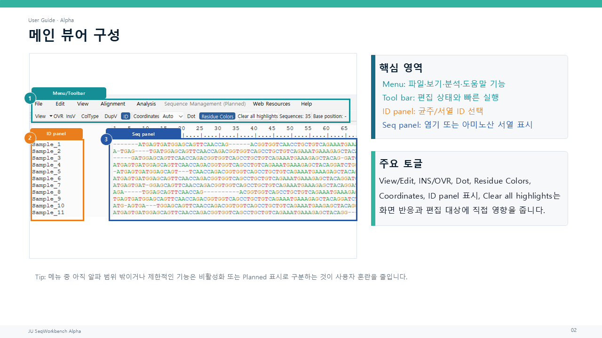

## 4. 프로젝트 만들기와 열기

1. `파일 > 새로 만들기` 또는 `Ctrl+N`으로 빈 작업공간을 엽니다.
2. 기존 프로젝트는 `파일 > 프로젝트 열기...`를 사용합니다.
3. 같은 프로젝트가 이미 열려 있으면 기존 창 활성화, 독립 사본 열기, 취소 중 하나를 선택합니다.
4. 독립 프로젝트 사본은 원본 경로에 직접 저장하지 않고 `프로젝트 다른 이름으로 저장...`을 사용합니다.

프로젝트 파일은 `.dvproj`가 기본이며 `.dvproj.json`과 서명이 맞는 레거시 `.json`을 열 수 있습니다. 일반 서열 `열기`는 별도 뷰어를 만들고, `가져오기`는 현재 뷰어에 레코드를 추가합니다.

## 5. FASTA와 서열 데이터 가져오기

1. 새 창으로 보려면 `파일 > 열기`/`Ctrl+O`를 선택합니다.
2. 현재 작업에 추가하려면 `파일 > 가져오기...`/`Ctrl+I`를 선택합니다.
3. 클립보드 FASTA는 `Ctrl+Alt+V`로 새 레코드로 붙여넣습니다.
4. 중복 ID가 조정되었다는 안내가 나오면 새 접미사를 확인합니다.

FASTA, 일반 서열 TXT, AB1/ABI가 지원 경로에 포함됩니다. 한 줄 FASTA는 `>Sample_1 SEQUENCE`처럼 ID와 서열을 구분할 수 있어야 합니다. 원시 서열의 종류가 모호하면 NT 또는 AA를 선택하라는 창이 나타날 수 있습니다.

## 6. 서열 검토와 편집

1. 도구막대에서 `Edit` 모드로 전환합니다.
2. 본문을 클릭해 커서를 놓거나 드래그해 범위를 선택합니다.
3. `Insert`로 `INS`(삽입 모드)와 `OVR`(덮어쓰기 모드)을 전환합니다.
4. 문자 입력, `Delete`/`Backspace`, `Ctrl+X`, `Ctrl+V`를 사용합니다.
5. `Ctrl+Z`/`Ctrl+Y`로 결과를 검토합니다.

일반 드래그는 이전 본문 하이라이트를 대체하며, `Ctrl`을 누른 채 드래그하면 새 하이라이트 레이어를 누적합니다.

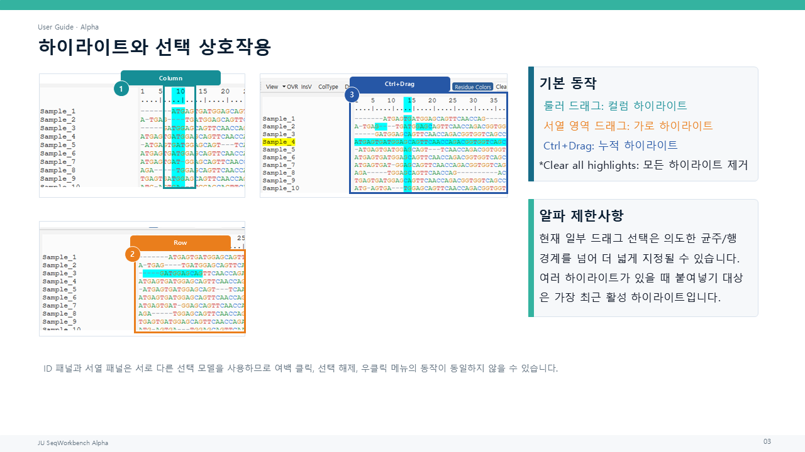

현재 행의 NT/RNA/AA 종류에서 허용되지 않는 문자는 차단됩니다. 하이라이트가 있을 때 `Delete`는 가장 최근 하이라이트의 실제 서열 데이터를 삭제하고 `Ctrl+Delete`는 모든 활성 하이라이트의 데이터를 삭제합니다. 표시만 지우려면 `모든 하이라이트 제거`를 사용하십시오.

한 서열을 별도 창에서 편집하려면 ID를 오른쪽 클릭하고 `Open Sequence in Editor...`를 선택합니다. 이 창은 모델리스이며 부모 뷰어와 Alt+Tab으로 전환할 수 있습니다. `Apply`는 한 번의 되돌릴 수 있는 부모 변경을 만듭니다.

## 7. 서열 ID 편집

1. ID 패널에서 정확히 한 행을 선택합니다.
2. `Copy ID`로 복사한 ID 또는 외부 프로그램의 적합한 일반 텍스트를 클립보드에 준비합니다.
3. ID 패널에 포커스를 둔 채 `Ctrl+V`를 누르거나 오른쪽 클릭 메뉴의 ID 이름 변경 항목을 사용합니다.
4. 중복 이름에 붙은 `_2`, `_3` 접미사를 확인합니다.

오른쪽 클릭 메뉴의 주요 동작은 다음과 같습니다.

- `Copy ID`: 선택한 ID 이름을 복사합니다. 여러 행이 선택되면 선택한 ID들을 복사합니다.
- `Copy Sequence`: 정확히 한 strain의 현재 작업 서열만 헤더 없이 복사합니다. 이 클립보드 데이터는 ID 이름 변경에 사용할 수 없습니다.
- `Copy as FASTA`: ID와 서열을 FASTA 형식으로 복사합니다. 여러 행을 선택하면 여러 FASTA 레코드가 유지됩니다.
- `Open Sequence in Editor...`: 선택한 단일 strain을 별도의 모델리스 편집기에서 엽니다.
- `Paste ID / Rename ID from Clipboard`: 단일 ID를 `Copy ID` 데이터 또는 적합한 일반 텍스트로 변경합니다. `Copy Sequence`에서 온 데이터는 ID로 적용되지 않습니다.
- `Delete Strain...` / `Delete Selected Strains...`: 선택한 strain을 삭제합니다. `Ctrl+Z`/`Ctrl+Y`로 실행 취소/다시 실행할 수 있습니다.
- `Move Sequence...`: 정확히 한 strain을 선택해 시작한 뒤 destination ID를 클릭하면 source strain이 destination 바로 위로 이동합니다. `Esc`로 대기 중인 이동을 취소할 수 있으며 이동은 `Ctrl+Z`/`Ctrl+Y`를 지원합니다.
- `Move to Bottom`: 선택한 단일 strain을 목록 마지막으로 이동합니다. 이 이동도 `Ctrl+Z`/`Ctrl+Y`를 지원합니다.

여러 ID가 선택되었거나 선택이 없으면 붙여넣기 이름 변경은 실행되지 않습니다. 여러 선택에서는 ID/FASTA 복사와 선택 strain 삭제를 사용할 수 있지만, `Copy Sequence`는 실행하지 않고 `Copy as FASTA` 사용을 안내합니다. 편집기 열기, ID 이름 변경, 이동은 단일 행 정책을 따릅니다. ID 패널의 `Ctrl+Alt+V`는 ID 이름 변경이 아니라 기존의 새 서열 붙여넣기입니다.

## 8. 외부 정렬 설정

1. MAFFT 또는 Clustal Omega를 애플리케이션과 별도로 설치합니다.
2. `정렬 > 외부 정렬 도구 설정`을 엽니다.
3. 로컬 실행 파일을 선택하거나 경로를 비워 둡니다.
4. 저장 후 설정 창을 닫습니다.

실행 파일은 JU SeqWorkbench에 포함되거나 자동 다운로드되지 않습니다. 로컬 사용자가 선택한 경로는 기존 QSettings에 저장됩니다. 경로가 비어 있으면 실행 시 `PATH`에서 `mafft` 또는 `clustalo`를 찾습니다. 설정 창의 테스트 컨트롤은 선택한 로컬 실행 파일을 임시 FASTA로 확인합니다.

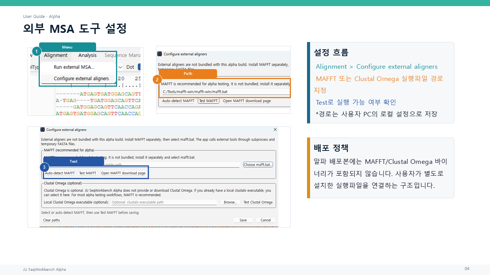

## 9. MAFFT 또는 지원 정렬 도구 실행

1. 정렬할 현재 작업 서열이 두 개 이상인지 확인합니다.
2. `정렬 > 외부 MSA 실행...`을 선택합니다.
3. MAFFT 또는 Clustal Omega를 선택합니다.
4. 진행 창과 오류/로그를 확인합니다.
5. 성공 후 새 뷰어로 열기, 현재 뷰어 교체, 정렬 FASTA 저장 또는 결과 버리기 중 필요한 동작을 선택합니다.

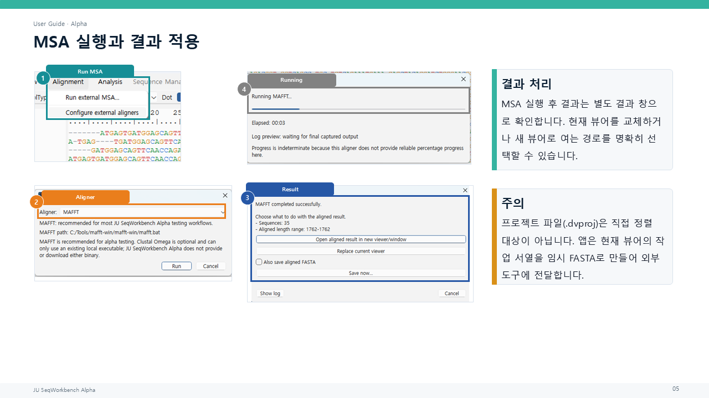

애플리케이션은 임시 FASTA를 만들고 외부 프로세스를 실행한 뒤 정렬 FASTA를 읽습니다. 현재 뷰어 교체는 편집 이력에 기록되며 하이라이트를 지웁니다. 실패 시 진단을 위해 임시 폴더가 유지될 수 있고 로그에서 경로와 명령을 확인할 수 있습니다.

## 10. NT, AA, DNA, RNA 변환

1. 변환할 ID 행을 선택합니다. 선택하지 않으면 모든 행이 대상입니다.
2. `Ctrl+D`/`아미노산 보기`, `Ctrl+W`/`DNA 보기`, `Ctrl+E`/`RNA 보기`를 사용합니다.
3. 상태 표시줄의 변환·복구·건너뜀 수를 확인합니다.
4. 필요한 경우 `Ctrl+Z`로 되돌립니다.

AA 보기는 NT 원본을 frame 0으로 번역합니다. DNA 보기는 보관된 NT 작업 상태로 돌아가며 AA 전용 레코드를 임의로 역번역하지 않습니다. RNA 보기는 `T/U` 표시를 전환합니다. 변환 시 본문/열 하이라이트가 지워지며 RNA 변환은 ID 선택도 지웁니다.

역방향, 상보, 역상보는 각각 `Ctrl+Alt+R`, `Ctrl+Alt+C`, `Ctrl+Alt+X`입니다. 선택 영역이나 ID 행이 없으면 전체 서열에 적용됩니다.

## 11. 포인트 시각화

1. `분석 > 시각화`에서 AA, NT 또는 Codon 포인트 시각화를 선택합니다.
2. 위치를 1부터 시작하는 좌표로 입력합니다. 예: `10,25,50`.
3. 필터와 기준 서열을 선택하고 필요한 포함/제외 옵션을 설정합니다.
4. `실행`을 누릅니다.
5. Visualization, Counts, Detail, Warnings 탭을 검토합니다.

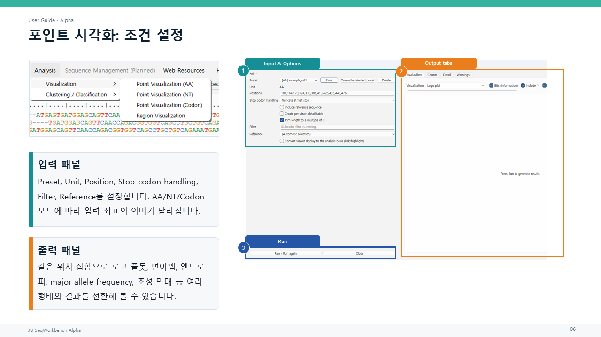

포인트 시각화는 선택 위치의 로고, 히트맵, 이진/범주형 변이 지도, entropy, major allele frequency, 제외 수, 변이 막대, 구성 누적 막대 등을 제공합니다.

Counts/Detail 표의 행을 선택하면 표시 종류가 호환될 때 부모 뷰어 위치와 서열 행이 하이라이트됩니다. CSV와 그림 저장 버튼으로 결과를 내보낼 수 있습니다.

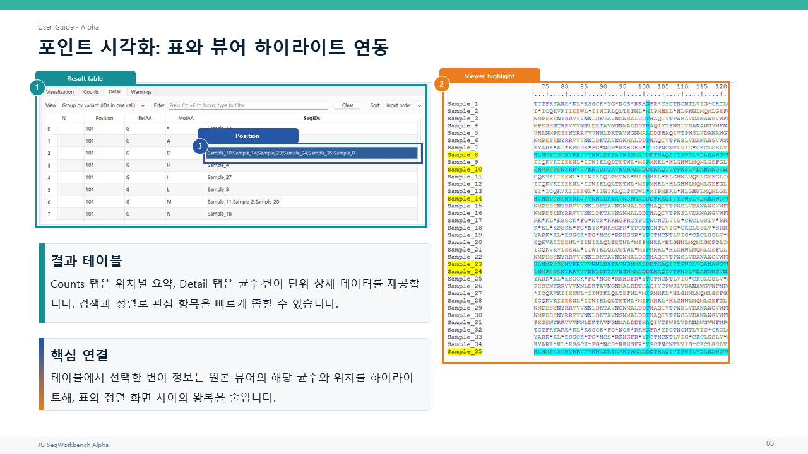

프리셋은 사용자 설정 위치에 저장되며 현재 배포 기본값에는 특정 데이터셋 위치가 없습니다.

## 12. 코돈 로고플롯

1. AA/NT 포인트 시각화에서 `Logo plot`을 선택하거나 Codon 포인트 시각화에서 `Codon logo plot`을 선택합니다.
2. gap, stop, unknown 포함 옵션과 bits/frequency 표시를 조정합니다.
3. 글꼴, 크기, 축 표시, publication 스타일을 선택합니다.
4. 다시 렌더링하고 그림을 저장합니다.

코돈 로고는 관찰된 완전한 세 문자 토큰을 그대로 쌓습니다. 예를 들어 `GAT`, `-AT`, `A-T`, `AT-`, `NAA`, `TAA`는 서로 다른 토큰입니다. **갭 포함 코돈**, **모호성 염기를 포함한 코돈**, **종결 코돈** 분류는 색상과 범례에만 사용되며 분류명이 로고 글리프로 표시되지 않습니다. 표준 코돈 색은 코돈 정체성별 색입니다.

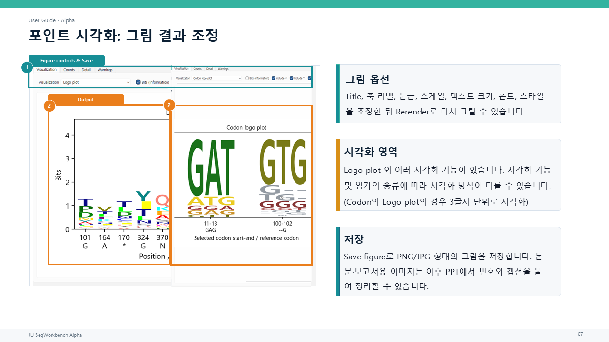

## 13. 범위 시각화

1. `분석 > 시각화 > 범위 시각화`를 엽니다.
2. 하나 이상의 시작-끝 범위를 입력합니다.
3. 기준 서열과 프로파일/요약 옵션을 선택합니다.
4. 실행 후 그림과 범위 지표 표를 검토합니다.
5. `Export CSV` 또는 `Save figure`로 저장합니다.

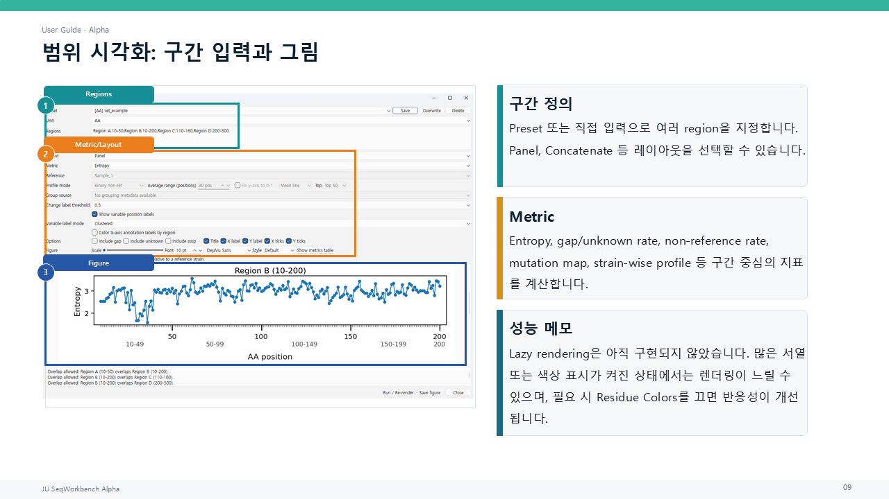

범위 시각화는 범위별 변이, entropy, 프로파일과 부담 요약을 다룹니다. 그림은 PNG/JPEG와 SVG/PDF 경로를 지원합니다. 현재 창 내부는 영어 우선이며, 결과 셀/그림 점을 클릭해 부모 뷰어를 하이라이트하는 연동은 구현되지 않았습니다.

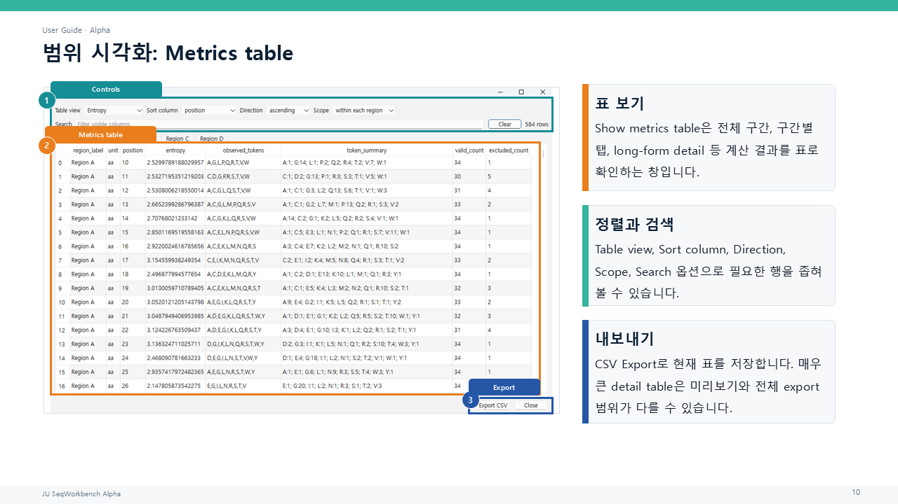

## 14. ID 기반 그룹화

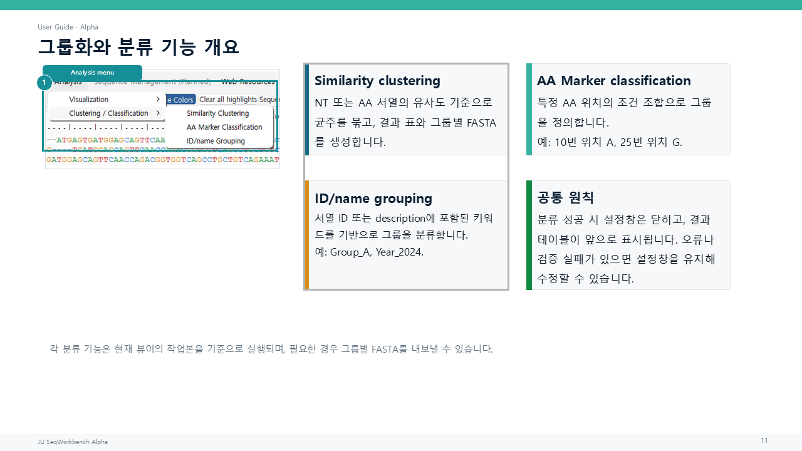

1. `분석 > 군집화 / 분류 > ID/이름 기반 그룹화`를 엽니다.
2. `새로 만들기`로 규칙셋을 만들고 그룹 규칙을 추가합니다.
3. `Group_A` 같은 중립적인 그룹 이름과 한 줄당 하나의 ID 패턴을 입력합니다.
4. 대소문자, 경계 일치, 다중 일치, 표시 형식 옵션을 검토하고 저장합니다.
5. 결과표 표시 및 그룹 FASTA 저장 여부를 선택한 뒤 실행합니다.

현재 뷰어의 서열 ID/이름 문자열을 규칙 패턴과 비교해 그룹을 만듭니다. 성공하면 설정 창이 닫히고 완료 안내 뒤 결과표가 앞으로 표시됩니다. 검증 또는 실행 실패 시 창은 열린 상태로 유지됩니다. 결과표의 일반 행 선택은 부모 뷰어 하이라이트와 연결되지 않습니다.

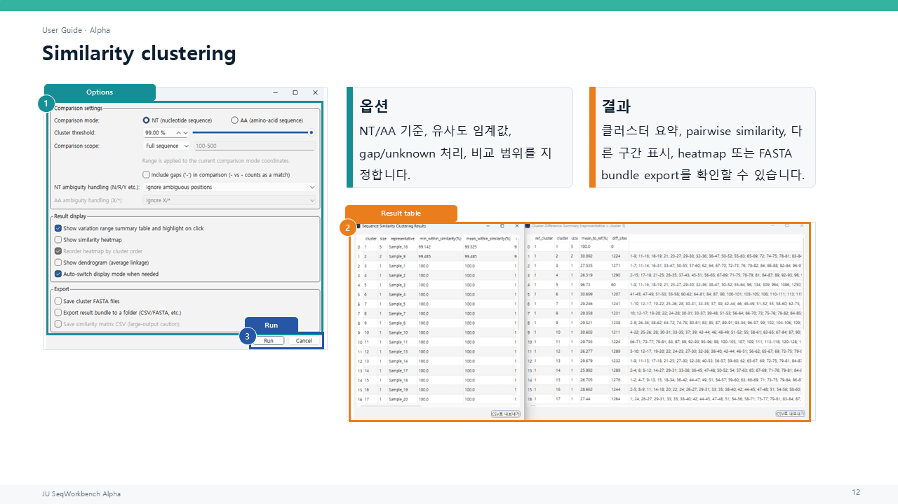

## 15. AA 마커 그룹화

1. `분석 > 군집화 / 분류 > AA 마커 기반 분류`를 엽니다.
2. 기본 내장 규칙셋이 없으므로 `새로 만들기`로 사용자 규칙셋을 만듭니다.
3. 그룹과 조건을 추가하고 1부터 시작하는 Position과 Allowed AA를 입력합니다.
4. 규칙셋을 저장하고 stop 처리, 다중 일치, 결과표/그룹 FASTA 옵션을 선택합니다.
5. `실행`을 누르고 결과를 검토합니다.

Position은 숫자만 입력되며 기존 범위 검증을 거칩니다. Allowed AA는 대문자로 정규화되고 지원 문자만 입력됩니다. 불완전하거나 잘못된 편집 버퍼는 모델에 저장되지 않습니다. 다른 규칙으로 이동할 때 경고 후 미적용 값을 버리고 클릭한 규칙을 표시합니다. 완전히 빈 새 조건은 경고 없이 버릴 수 있습니다.

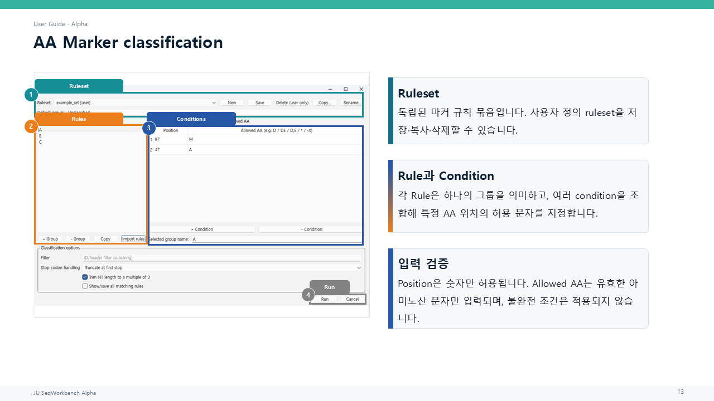

성공 시 설정 창을 닫고 안내 뒤 결과표를 앞으로 표시합니다. 실패 시 창을 유지합니다. 사용자 규칙은 기존 `typing_rulesets.json` 저장 형식을 사용합니다.

## 16. 유사도 군집화

1. `분석 > 군집화 / 분류 > 유사도 기반 군집화`를 엽니다.
2. NT 또는 AA 비교 모드와 군집 임계값을 선택합니다.
3. gap 및 모호성 처리, 전체 서열/수동 범위, 히트맵·덴드로그램·변이 구간 표 옵션을 설정합니다.
4. 선택된 ID 행 또는 선택이 없을 때 전체 현재 서열을 대상으로 실행합니다.
5. 결과표와 선택적 그림/FASTA/결과 묶음을 검토합니다.

최소 두 서열이 필요합니다. 길이가 다르면 정렬 확인을 요청합니다. 수동 범위는 현재 비교 모드의 1-based 좌표입니다. 성공 시 설정 창이 닫히고 결과표가 앞으로 표시되며 실패 시 창을 유지합니다. 결과표 행은 군집 구성원을, 변이 구간 표 행은 가능한 경우 구성원과 열 범위를 부모 뷰어에 하이라이트합니다.

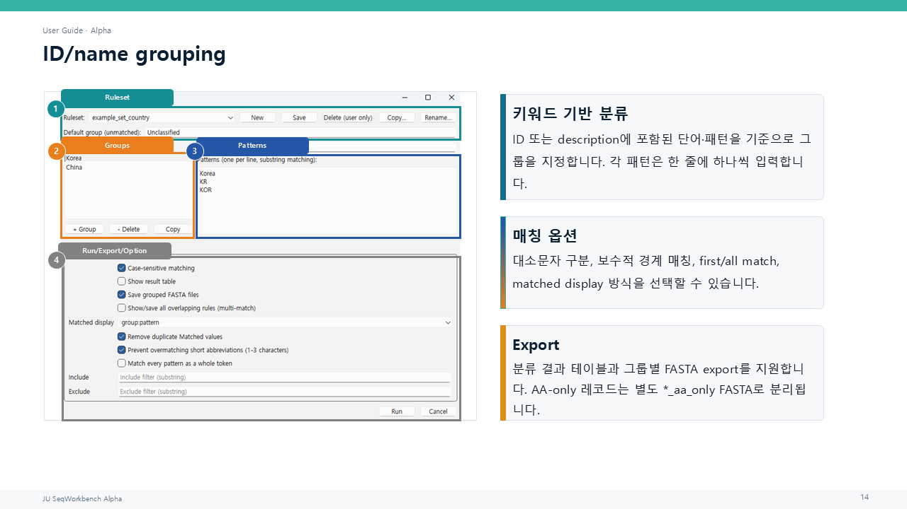

## 17. 결과표와 뷰어 하이라이트

1. 포인트 Counts/Detail 또는 유사도 결과표에서 행을 선택합니다.
2. 부모 뷰어의 ID 행과 위치 하이라이트를 확인합니다.
3. 표시 모드 불일치 안내가 나오면 분석 모드와 NT/AA 표시를 확인합니다.
4. 필요하면 `모든 하이라이트 제거`로 연결 결과를 지웁니다.

모든 결과표가 부모 뷰어와 연결되는 것은 아닙니다. 현재 확인된 연결은 포인트 시각화와 유사도 결과표입니다. 범위 시각화, AA 마커, ID/이름 그룹화 결과표의 일반 행 선택에는 같은 연결이 없습니다. 표에서 `Ctrl+C`는 선택 셀을 헤더와 함께 TSV 형태로 복사합니다.

## 18. AB1 크로마토그램 워크플로

1. AB1/ABI를 새 문서로 열려면 `파일 > 열기`를 사용합니다.
2. 현재 뷰어에 추가하려면 `파일 > 가져오기...`에서 AB1을 선택합니다.
3. 트레이스 창 표시와 원본/역상보 방향을 선택합니다.
4. 트레이스, basecalled sequence, 품질 요약과 경고를 검토합니다.
5. 시작/끝 trim 범위를 조정하고 필요한 방향으로 가져옵니다.

애플리케이션은 AB1에 이미 저장된 basecall을 읽으며 새 basecalling을 수행하지 않습니다. 트레이스 창은 위치 스크롤, 이전/다음, 확대/축소, 원본/역상보 표시를 제공합니다. 여러 AB1 가져오기에서 중복 ID는 조정됩니다.

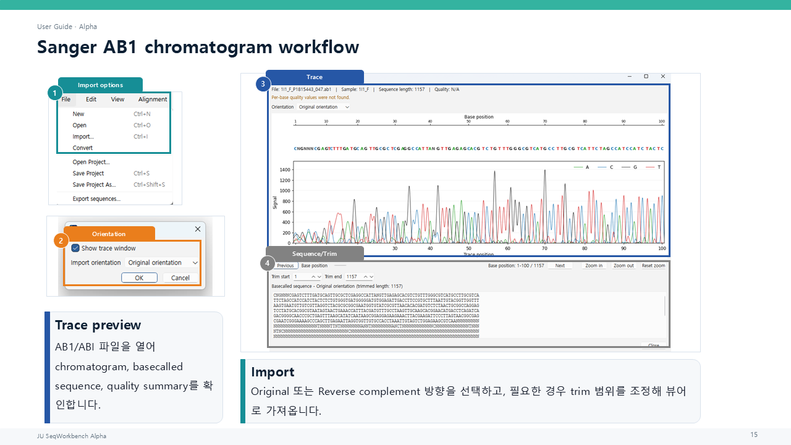

## 19. 표와 그림 내보내기

1. 메인 서열은 `파일 > 서열 내보내기...`에서 FASTA, CSV 서열 표 또는 TXT로 저장합니다.
2. 결과표의 CSV 내보내기 버튼 또는 오른쪽 클릭/복사 기능을 사용합니다.
3. 포인트·범위·유사도 그림의 저장 버튼을 사용합니다.
4. 그룹화/분류의 그룹 FASTA 옵션을 선택하면 저장 대상과 덮어쓰기를 확인합니다.

프로젝트 저장과 데이터 내보내기는 별개입니다. `Ctrl+S`는 프로젝트 저장이며 FASTA 원본 덮어쓰기가 아닙니다. AA 전용 레코드는 AA FASTA로 분리될 수 있고 AA에서 NT로 임의 변환하지 않습니다. 복제 뷰어는 프로젝트 및 뷰어 수준 서열 데이터 내보내기를 차단합니다.

## 20. 프로젝트 저장과 다시 열기

1. `Ctrl+S` 또는 `파일 > 프로젝트 저장`을 사용합니다.
2. 처음 저장하거나 독립 프로젝트 사본이면 저장 경로를 선택합니다.
3. 작업을 종료한 뒤 `프로젝트 열기...`로 다시 엽니다.
4. 서열 순서, 현재 작업 상태와 표시 설정을 확인합니다.

프로젝트는 원본/현재 NT·AA 작업 상태와 관련 뷰어 상태를 보관합니다. 실행 취소/다시 실행 이력은 프로젝트에 저장되지 않으므로 다시 연 세션에서는 새 이력이 시작됩니다. 알파 테스트에서는 프로젝트 파일도 별도 백업하십시오.

## 21. 문제 해결

1. 시작이 늦으면 시작 화면이 먼저 나타나는지 확인하고 첫 메인 창 이벤트까지 기다립니다.
2. 정렬 실행 파일 오류가 나면 설정 경로와 `PATH`를 확인합니다.
3. 유사도/포인트 하이라이트가 보이지 않으면 NT/AA 비교 모드와 현재 표시 종류를 맞춥니다.
4. FASTA 붙여넣기가 본문에서 거부되면 `Ctrl+Alt+V`를 사용합니다.
5. 여러 레코드 복사는 `Copy Sequence`가 아니라 `Copy as FASTA`를 사용합니다.
6. 메인 `Ctrl+F`가 검색하지 않는 것은 현재 알파의 알려진 제한입니다.
7. 대용량 분석 중에는 사전 확인과 작업 중 표시를 기다리고 결과 생성이 끝났는지 확인합니다.

오류 메시지가 있는 설정 창은 닫히지 않으므로 값을 수정해 다시 실행할 수 있습니다. 외부 MSA 실패 창에서는 `Show log`로 명령, 출력, 임시 경로를 확인할 수 있습니다.

## 22. 알려진 제한

요약하면 외부 정렬 도구 별도 설치, 세션 간 Undo 미복원, 대용량 성능, 제한된 AB1 고급 기능, 메인 찾기 미구현, 일부 영어 우선 UI와 제한된 결과표 연동이 있습니다. 현재 공개 제한사항 요약은 [Alpha Limitations & Cautions](../limitations/)를 참조하십시오.

## 23. 피드백과 버그 보고

1. `도움말 > 버전 정보`에서 현재 알파 버전을 확인합니다.
2. 재현에 사용한 입력 종류(FASTA, AB1, 프로젝트), 서열 수, 대략적인 길이를 기록합니다.
3. 클릭 순서, 기대 결과, 실제 결과와 오류 메시지를 기록합니다.
4. 개인·민감 서열을 제거한 중립 예제(`Sample_1`, `Sample_2`, 위치 `10, 25, 50`)로 재현 가능하면 함께 설명합니다.
5. `도움말 > 사용자 가이드`에 표시된 현재 Issues 또는 Discussions 경로로 보고합니다.

프로젝트나 실제 서열을 첨부하기 전에 공개 가능한 데이터인지 확인하십시오. 로컬 실행 파일 경로와 사용자 프로필 경로는 보고서에서 가리십시오.

## 관련 문서

- [Alpha Limitations & Cautions](../limitations/)
