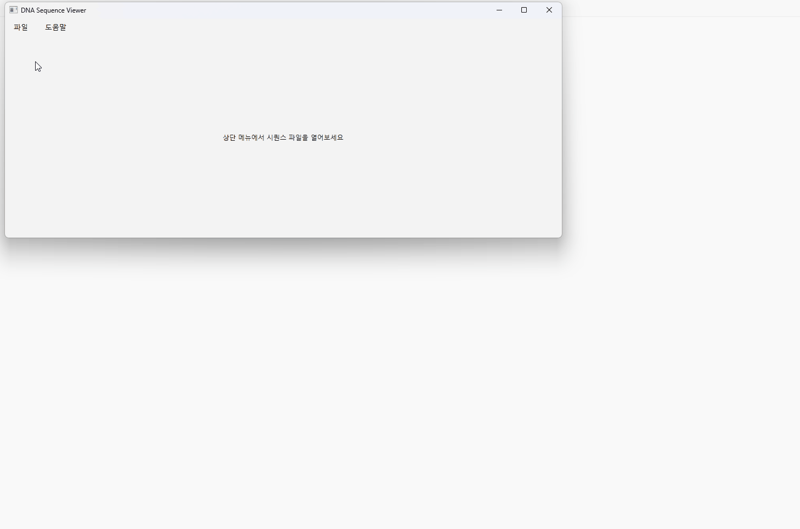

# JU-works Sequence Viewer

Sanger/FASTA sequence inspection in one desktop workflow.

A pre-alpha desktop tool for reducing tool-hopping between sequence review, grouping, site-based mutation checks, region-based visualization, and export.


## Sanger/FASTA sequence inspection in one desktop workflow

JU-works Sequence Viewer is a pre-alpha desktop tool for reviewing Sanger/FASTA sequence data, checking marker sites, exploring mutation patterns across continuous regions, grouping sequences, and exporting tables or figures.

Many existing tools are powerful, but small-scale sequence review often involves moving between separate programs for viewing, editing, grouping, visualization, and export. This project aims to reduce that tool-hopping by connecting those steps into one practical workflow.

Why this project?

Many existing sequence analysis tools are powerful, but practical Sanger/FASTA review often requires moving between multiple tools for small but repeated tasks:

- checking aligned sequences
- reviewing selected mutation sites
- comparing continuous regions
- grouping sequences by ID, marker rules, or similarity
- exporting tables, FASTA files, and figures

This project aims to connect those steps into one desktop workflow.

### Workflow preview
JU-works Sequence Viewer is designed to connect common small-scale sequence review steps in one desktop workflow.




Focus
- FASTA and Sanger AB1 review
- editable sequence inspection
- site-based mutation checks
- region-based mutation visualization
- ID/label, marker-rule, and similarity-based grouping
- CSV, FASTA, and figure export

Not the focus

This project is not intended for large-scale NGS analysis, read mapping, variant calling, or genome assembly.

Current status

Pre-alpha development.
The project is currently being stabilized and documented. It is not publicly released yet.
> Current status: pre-alpha development
> This project is not yet distributed. The current focus is feature stabilization, packaging review, license review, and development documentation.

---

## Feedback wanted

This project is currently in a pre-alpha / alpha workflow validation stage.

I am especially interested in feedback from people who review:

- Sanger sequencing results
- FASTA files
- small MSA datasets
- viral or amplicon sequence sets

Useful feedback includes:

- Which parts of sequence review feel repetitive or inconvenient
- Whether FASTA → MSA → site/region inspection → export matches a real workflow
- Which outputs would be useful before trying an alpha build
- Which features are necessary for practical use

Feedback can be shared through GitHub Issues or by contacting me directly.

---

## Project overview

This project started from a practical problem: routine sequence inspection often requires moving between several tools for sequence viewing, manual checking, alignment review, mutation inspection, grouping, and figure/table preparation.

The goal of this viewer is not to replace every existing bioinformatics tool. Instead, it aims to make common inspection workflows faster and more connected.

The current development focus is:

* opening and reviewing FASTA sequence files
* opening and importing Sanger AB1 reads
* checking basecalled sequences and chromatogram traces
* editing and organizing sequence data
* reviewing alignment results
* grouping sequences by ID labels, marker rules, or similarity
* inspecting selected mutation sites
* visualizing continuous sequence regions
* exporting tables, FASTA files, and figures

---

## Core workflow

The intended workflow is:

```text
FASTA / AB1 input
→ sequence viewing and editing
→ alignment review
→ grouping / typing / similarity inspection
→ site or region visualization
→ table / figure / FASTA export
```

This workflow is designed for practical sequence-checking situations where users need to move quickly from raw sequence data to interpretable tables and figures.

---

## Current feature areas

### Sequence viewer and editing

The viewer supports basic sequence viewing, selection, copy/paste workflows, column-based editing, undo/redo behavior, and single-sequence editing.

This part focuses on making manual sequence inspection less painful while preserving the current working state consistently.

### Sanger AB1 workflow

The AB1 workflow supports opening Sanger trace files, displaying chromatogram traces, importing basecalled sequences, and handling reverse-complement orientation.

This is intended to help users quickly compare raw Sanger reads with the main sequence viewer workflow.

### Grouping and typing

The project includes early workflows for ID/label-based grouping, amino-acid marker-based typing, and similarity-based sequence grouping.

These functions are designed to help users organize sequence sets before deeper inspection or export.

### Visualization and inspection

The visualization workflow is divided into two major types:

* site-based visualization for known marker or hotspot positions
* region-based visualization for continuous intervals or multiple regions

This separation is intentional because selected-position inspection and continuous-region inspection answer different biological questions.

### Export and reporting

Current export workflows focus on practical outputs such as CSV tables, FASTA files, grouped FASTA outputs, and figure exports.

Full report generation is treated as future work.

---

## Development logs

### Foundation

* [Devlog 01 — Project Direction](./devlog/01-project-direction/)
* [Devlog 02 — Data Layer and Working State](./devlog/02-data-layer-and-working-state/)
* [Devlog 03 — Editing and Interaction Model](./devlog/03-editing-and-interaction-model/)

### Analysis and visualization

* [Devlog 04 — Classification and Grouping](./devlog/04-Classification%20and%20grouping/)
* [Devlog 05 — Visualization and Inspection](./devlog/05-visualization-and-inspection/)
* [Devlog 06 — Tree-Based Inspection and Phylogenetic Workflow](./devlog/06-tree-based-inspection-and-phylogenetic-workflow/)
* [Devlog 07 — Annotation and Region Metadata](./devlog/07-annotation-and-region-metadata-layer/)

### Output, Sanger, and alpha preparation

* [Devlog 08 — Export and Reporting Workflow](./devlog/08-export-and-reporting-workflow/)
* [Devlog 09 — Sanger AB1 Workflow](./devlog/09-sanger-AB1-workflow/)
* [Devlog 10 — External MSA and Tool Manager](./devlog/10-external-MSA-and-tool-manager/)
* [Devlog 11 — Packaging, License, and Alpha Preparation](./devlog/11-packaging-license-and-alpha-preparation/)

---


## Notes

This project is currently in pre-alpha development.

At this stage:

* no public release package is provided
* no tester recruitment is open
* no sales or pricing information is provided
* external tool packaging and open-source license compliance are still being reviewed
* the current focus is development documentation and workflow stabilization

Screenshots and short workflow demos will be added as the alpha preparation progresses.
 
## Documentation

- [Roadmap](docs/roadmap/)
- [Scope](docs/scope/)
- [Workflow Concept](docs/workflow/)
- [Planned Features](docs/features/)

---
## Feedback

DNA Viewer Alpha feedback is welcome.

- Bug reports / reproducible errors: [GitHub Issues](https://github.com/user92-11/JU-works/issues)
- Questions / ideas / general feedback: [GitHub Discussions](https://github.com/user92-11/JU-works/discussions)

Please do not upload confidential or unpublished sequence data publicly.
