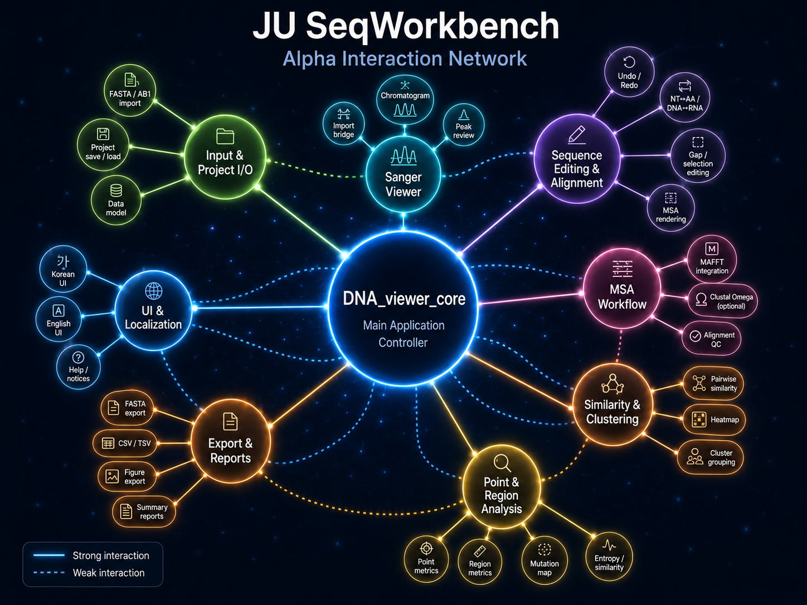
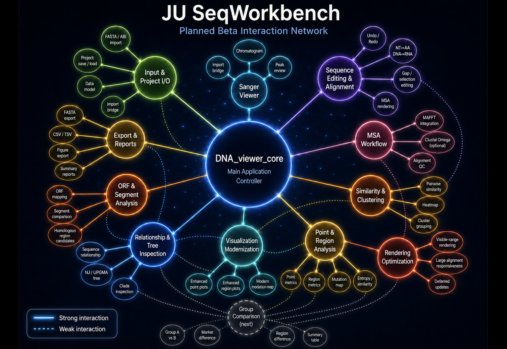
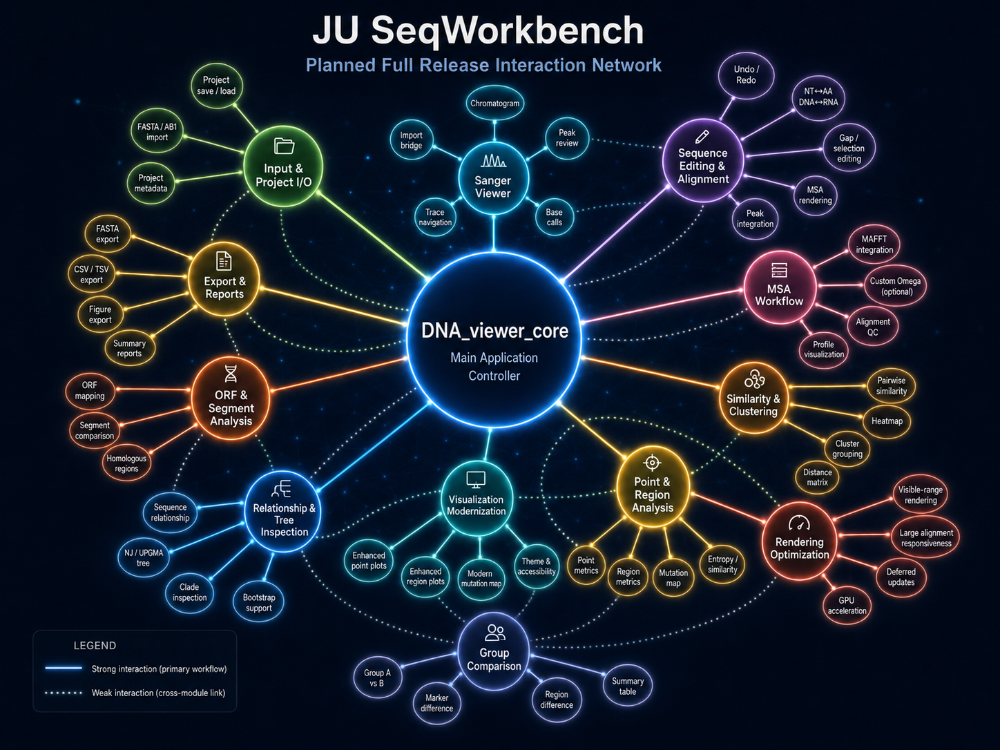

# JU SeqWorkbench Alpha

Sanger/FASTA sequence inspection, editing, grouping, visualization, and export in one local desktop workflow.

JU SeqWorkbench Alpha is being developed for practical sequence-review work where sequence data has already been generated or prepared. The goal is to reduce repeated tool-switching between sequence inspection, editing, alignment review, grouping, mutation/variability analysis, visualization, and export.

It is **not** intended to replace large-scale NGS analysis platforms, read mapping, primary variant calling, or genome assembly pipelines.

> **August 2026 update:** `0.1.0-alpha` is in final release preparation. The current release gate is: open-source license/distribution review → any required packaging corrections → final manual workflow testing → public GitHub alpha package.

## Why this project?

Routine Sanger/FASTA review can still involve moving between several tools for small but repeated tasks:

- checking aligned sequences
- editing IDs or sequence rows
- reviewing selected mutation sites
- comparing continuous regions
- grouping sequences by ID, marker rules, or similarity
- running an external MSA engine
- exporting tables, FASTA files, and figures

JU SeqWorkbench aims to connect those steps into one focused desktop workflow.

### Workflow preview


---

## Current Alpha scope

The current `0.1.x` workflow includes:

- FASTA and Sanger AB1 import/review
- chromatogram trace inspection
- editable NT/AA sequence viewing
- project save/load
- undo/redo and row/column editing workflows
- user-installed external MSA integration
- MAFFT as the recommended alpha aligner path
- optional local Clustal Omega integration
- Point Visualization for selected AA, NT, or codon sites
- Region Visualization for continuous intervals or multiple regions
- similarity clustering
- AA marker classification
- ID/name grouping
- CSV/TSV, FASTA, grouped FASTA, and figure export
- Korean / English UI support
- alpha-level preflight and busy-state guardrails for larger analysis jobs

The analysis path is designed to use the current working sequence state rather than silently falling back to stale imported data.

---

## Known Alpha limitations

The first alpha is intentionally being released before every presentation and performance issue is polished.

The main limitations that will be stated openly with the release are:

- larger alignments and some analysis views may still render slowly
- current visualization is functional-first and will be visually modernized after alpha feedback
- relationship/tree inspection is not yet active in the alpha workflow
- ORF/segment-aware analysis is not yet implemented
- group-to-group comparison is planned for a later stage
- annotation and broader sequence-management features remain deferred

The goal of the first public alpha is workflow validation: **does the current sequence-review process save time, and which analysis/visualization views are actually worth improving next?**

---

## Alpha → Beta → Full Release direction

The project roadmap is intentionally conservative. Post-alpha development is focused on improving the existing workflow before adding unrelated platform-scale features.

### Interaction-network roadmap

The diagrams below are a visual interpretation of how the current modules interact and how the workflow may expand over time. Solid lines represent primary/strong workflow interactions; dotted lines represent weaker, supporting, or cross-module interactions.

**Alpha — current interaction network**



**Planned Beta interaction network**



**Possible Full Release interaction network**



> Beta and Full Release diagrams are conceptual roadmaps. Their exact structure may change based on implementation results, alpha feedback, and workflow priorities.

### Alpha — current foundation

```text
FASTA / AB1 input
→ sequence review and editing
→ external MSA / alignment review
→ grouping / typing / similarity
→ point or region analysis
→ visualization / export
```

### Beta — first post-alpha priorities

The current expected priorities are:

1. **Rendering and performance optimization**
   - reduce unnecessary redraws
   - improve responsiveness for larger alignments/results
   - investigate visible-range or incremental rendering

2. **Visualization modernization**
   - improve Point plots
   - improve Region plots
   - modernize mutation maps and summary layouts
   - make it easier to move from a visual pattern back to the underlying sequences

3. **Sequence relationship and tree inspection**
   - NT/AA sequence relationship views
   - pairwise similarity/distance inspection
   - simple NJ/UPGMA-style distance-tree views
   - clade/subset selection linked back to the alignment workflow

4. **ORF- and segment-aware analysis**
   - ORF mapping/selection
   - segment-level comparison
   - candidate homologous-region exploration
   - selection of comparable clades/ORFs/segments before detailed site analysis

Group-to-group comparison remains important, but is currently positioned **after** these first post-alpha priorities.

### Toward a full release

The likely full-release direction is to integrate and stabilize the workflows that prove useful during alpha/beta testing:

- optimized rendering and responsiveness
- modernized Point/Region visualization
- relationship/tree-assisted inspection
- ORF- and segment-aware analysis
- group-to-group comparison
- stronger comparison summaries and export/report workflows
- selected annotation/metadata features where they directly support sequence comparison

Cloud collaboration, enterprise administration, large API ecosystems, and fully integrated AI analysis are **not** currently committed full-release requirements.
